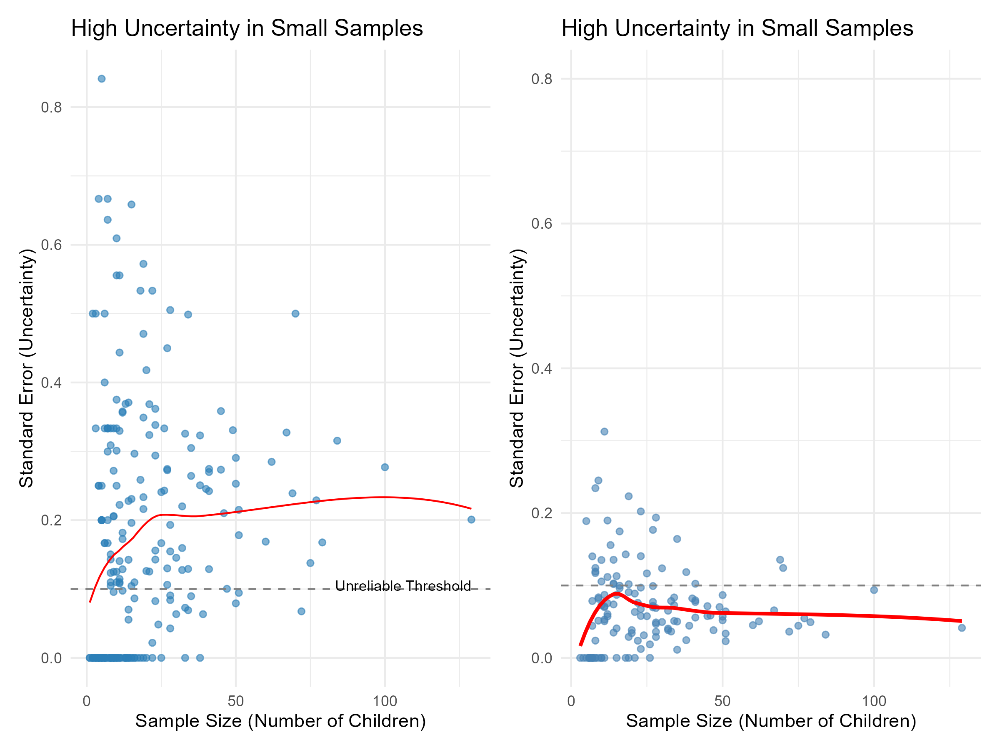
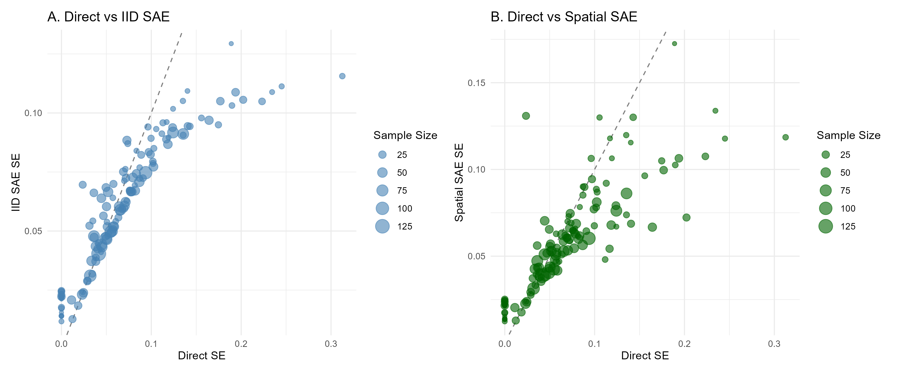
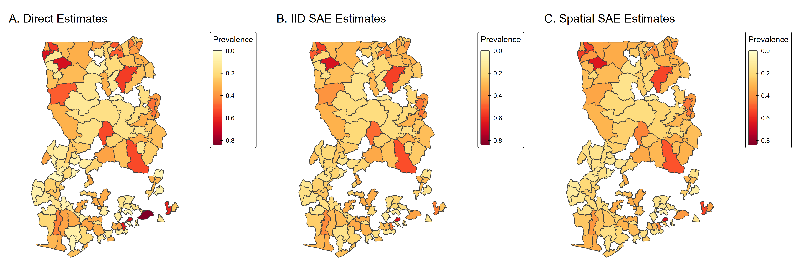

```{css, echo=FALSE}
div.logo_left{
  width: 20%;
}
div.poster_title{
  width: 80%;
}
.section h4 {
    break-after: column;
}
div.footnotes {
    font-size: 18pt;
}
```

<!-- Don't change anything above, except the title and author names, unless you know what you are doing. -->

```{r, include=FALSE}
knitr::opts_chunk$set(echo = FALSE,
                      warning = FALSE,
                      tidy = FALSE,
                      message = FALSE,
                      fig.align = 'center',
                      out.width = "100%")
options(knitr.table.format = "html") 
# Load any additional libraries here
library(tidyverse)
library(plotly)
library(kableExtra)
library(pagedown)
```

# Background
<!-- Malaria remains a critical public health challenge in West Africa. While Demographic and Health Surveys (DHS) provide essential data on prevalence and intervention coverage, they are designed for national-level precision[^1]. When disaggregated to the district level, direct estimates suffer from small sample sizes, resulting in high standard errors that render them unreliable for local policy planning[^2]. -->

<!-- Furthermore, attempting causal inference with area-level data risks the ecological fallacy, where associations observed at the group level may not reflect individual-level relationships[^3]. Before any robust causal analysis can be attempted, statistical stabilization through Small Area Estimation is required. -->

Malaria remains a major public health challenge in West Africa. Demographic Health Surveys (DHS) provide essential prevalence data but are designed for national-level precision[^1]. At the district level, small sample sizes produce unreliable estimates[^2], and area-level causal inference risks ecological fallacy.


[^1]: Corsi, D. J., Neuman, M., Finlay, J. E., & Subramanian, S.. (2012). Demographic and health surveys: a profile. International Journal of Epidemiology, 41(6), 1602–1613. https://doi.org/10.1093/ije/dys184
[^2]: Rao, Jnk, and Isabel Molina. Small Area Estimation /. Second. Hoboken, New Jersey : Wiley, 2015. Print.
<!-- [^3]: Robinson, W. S. (1950). Ecological correlations and the behavior of  -->
<!-- individuals. American Sociological Review, 15(3), 351–357.. -->

**Primary Aim**: To develop reliable district-level estimates of malaria burden and intervention coverage using Small Area Estimation methods.

**Sub Aims:** <br>
1.  To Calculate survey-weighted direct estimates and assess reliability. <br>
2.  To Apply Fay-Herriot models to produce smoothed small area estimates. <br>
3.  To Compare independent vs. spatial random effects specifications. <br>
4.  To Investigate causal effects of interventions at small area level *(Future)*.

<!-- it's acting quite odd here, see if you can fix it - there's an extra bit of space above the next line if I add the page break-->

# Methodology 

Models were fitted using Bayesian inference in Stan[^3]

**Survey-Weighted Direct Estimation**

$$\hat{p}_i = \frac{\sum w_j y_j}{\sum w_j}$$

where $w_j$ = sampling weight, $y_j$ = outcome for individual $j$ in district $i$.

**Fay-Herriot Model**

*Sampling:* $\hat{\theta}_i | \theta_i \sim N(\theta_i, \psi_i^2)$

*Linking (IID):* $\theta_i = \mathbf{x}_i'\boldsymbol{\beta} + u_i$, where $u_i \sim N(0, \sigma_u^2)$

*Linking (Spatial):* $\theta_i = \mathbf{x}_i'\boldsymbol{\beta} + \phi_i$, where $\phi$ follows ICAR prior

**Shrinkage Estimator:**

$$\hat{\theta}_i^{SAE} = \gamma_i \hat{\theta}_i^{DIR} + (1 - \gamma_i) \mathbf{x}_i'\boldsymbol{\beta}$$

where $\gamma_i = \frac{\sigma_u^2}{\sigma_u^2 + \psi_i^2}$ balances data reliability vs. model prediction.

[^3]: Stan Development Team. (2024). Stan Modeling Language Users Guide 
and Reference Manual, Version 2.34. https://mc-stan.org

<!-- **Survey-Weighted Direct Estimation** <br> -->
<!-- DHS uses complex survey design with stratification and clustering. Weights account for unequal selection probabilities. -->

<!-- **Direct estimate formula:** -->

<!-- $$\hat{p}_i = \frac{\sum w_j y_j}{\sum w_j}$$ -->
<!-- where $w_j$ is the sampling weight and $y_j$ is the outcome for individual $j$ in district $i$. -->

<!-- **Fay-Herriot Model** -->

<!-- Sampling Model: -->
<!-- $$ \hat{\theta}_i | \theta_i \sim N(\theta_i, \psi_i^2)$$ -->

<!-- Linking Model (IID): -->

<!-- $$\theta_i = x_i'\beta + u_i$$ where $u_i \sim N(0, \sigma_u^2)$ -->

<!-- Linking Model (Spatial): -->

<!-- $$\theta_i = x_i'\beta + \phi_i$$ where $\phi$ follows ICAR prior -->

# Data Sources

```{r data-table, echo=FALSE}
data_table <- data.frame(
  Source= c("Ghana DHS 2022[^4]", "", "", "", "MAP", "", "WHO"),
  Variable = c("Malaria prev (Outcome)", "Artemisinin-based Combination Therapy (ACT)", "Insecticide-Treated Net (ITNs) (Covariate)", "Survey design",
               "Plasmodium falciparum Parasite Rate (PfPR, Covariate) ", "Accessibility (covariate)", "Boundaries"),
  Description = c("Microscopy test (~2 wk)", "ACT for fever", "Slept under net",
                  "Strata, clusters, weights", "Modeled parasite rate",
                  "Travel time to facility", "District polygons")
)

kable(data_table, col.names = c("Source", "Variable", "Description")) %>%
  kable_styling(font_size = 25, full_width = TRUE) %>%
  row_spec(0, bold = TRUE)

```
**Study Population:** Children 6-59 months, the WHO standard 
indicator population for malaria prevalence, serving as a proxy 
for national transmission intensity[^5].

_DHS surveys are conducted over approximately 3+ months. Seasonal variation in malaria transmission may affect estimates from regions measured at different times of year_


[^4]: Ghana Statistical Service (GSS), Ghana Health Service (GHS), and ICF. 
2023. Ghana Demographic and Health Survey 2022. Accra, Ghana, and 
Rockville, Maryland, USA: GSS, GHS, and ICF. https://dhsprogram.com/pubs/pdf/FR387/FR387.pdf

[^5]: World Health Organization. (2015). Global technical strategy for 
malaria 2016-2030. WHO. https://www.who.int/publications/i/item/9789240031357

# Early Results

<!-- Add charts here -->

```{r, echo=FALSE, out.width="103%", fig.align="center", fig.cap="SE vs Sample Size ~ Direct and SAE Estimates (Malaria Prevelance)"}

```

As shown in Figure 1, direct survey estimates have high uncertainty in small-sample districts, with 70% showing CV > 20%.

```{r, echo=FALSE, out.width="103%", fig.align="center", fig.cap="SE vs Sample Size (Independently and Identically Distributed (IID) & Spatial  Intrinsic Conditional Autoregressive (ICAR)  (Malaria Prevelance)"}

```
Small Area Estimation reduces standard errors by borrowing strength from model predictions and neighboring districts

```{r, echo=FALSE, out.width="103%", fig.align="center", fig.cap="Ghana Malaria Prelalemce (Direct, IID, Spatial"}

```
Spatial SAE produces smoothest estimates while preserving true geographic variation. SE reduced by 17%, increasing reliable districts from 30% to 38%

```{r data-table-2, echo=FALSE}
data_table_results <- data.frame(
  Model = c("Direct Estimates", "IID (no covariates)", "IID + covairiates", "Spatial (ICAR)"),
  Sigma_Parameter = c(" - ", "sigma_mu = 0.66","sigma_mu = 0.66", "sigma phi = 0.99"),
  Mean_SE = c(0.071, 0.060, 0.06, 0.059),
  SE_Reudction = c("-", "14.5%", "14.5%", "17.0%"),
  Reliable_CV = c("30% (41/137)", "34% (47/137", "34% (47/137", "38% (52/137)")
)

kable(data_table_results, col.names = c("Model", "Sigma Parameter", "Mean SE", "SE Reduction", "Reliable CV (<20%)" )) %>%
  kable_styling(font_size = 25, full_width = TRUE) %>%
  row_spec(0, bold = TRUE)

```

**Model Selection (LOO-CV):**
Models were compared using Leave-One-Out Cross-Validation (LOO-CV), which estimates out-of-sample predictive accuracy.

```{r loo-table, echo=FALSE}
loo_table <- data.frame(
  Model = c("Spatial ICAR", "IID + Covariates", "IID (no covariates)"),
  ELPD = c("0.0 (ref)", "-2.3", "-2.5"),
  SE = c("-", "1.8", "1.9"),
  Ranking = c("Best", "2nd", "3rd")
)

kable(loo_table, align = c("l", "c", "c", "c")) %>%
  kable_styling(font_size = 24, full_width = TRUE) %>%
  row_spec(0, bold = TRUE)
```
Best model has a higher Expected Log Pointwise Predictive Density (ELPD). Notably, adding covariates (ITN, PfPR, Accessibility) did not improve model fit spatial structure explains more district-level variation than environmental predictors.

# Next Project Steps

- Implement Besag-York-Mollié 2 model (BYM2 model) <br>
- Add temporal smoothing with multi-year DHS  <br>
- Extend SAE to ITN/ACT coverage outcomes  <br>
- Apply to other West African countries <br>
- Investigate the possibility of causal intervention effects based on SAE and develop Shiny dashboard for policy-makers

# GitHub

The code and datasets for this project can be viewed at our GitHub repository here: <https://github.com/SAHagen/HDS5106>

# References


