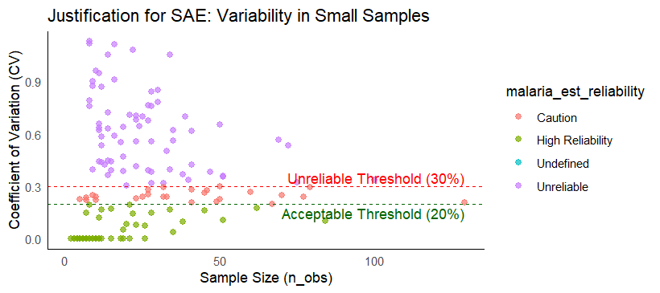
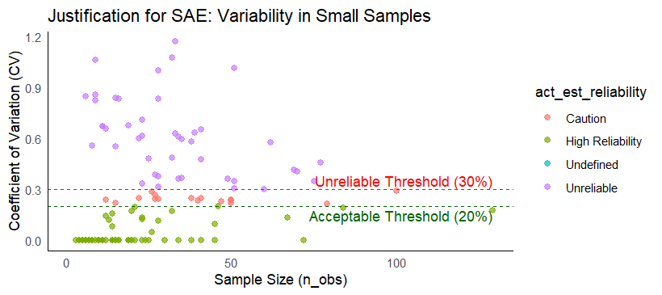

```{css, echo=FALSE}
div.logo_left{
  width: 20%;
}
div.poster_title{
  width: 80%;
}
.section h4 {
    break-after: column;
}
div.footnotes {
    font-size: 18pt;
}
```

<!-- Don't change anything above, except the title and author names, unless you know what you are doing. -->

```{r, include=FALSE}
knitr::opts_chunk$set(echo = FALSE,
                      warning = FALSE,
                      tidy = FALSE,
                      message = FALSE,
                      fig.align = 'center',
                      out.width = "100%")
options(knitr.table.format = "html") 
# Load any additional libraries here
library(tidyverse)
library(plotly)
library(kableExtra)
library(pagedown)
```

# Background and Problem
Malaria remains a critical public health challenge in West Africa. While Demographic and Health Surveys (DHS) provide essential data on prevalence and intervention coverage, they are designed for national-level precision[^1]. When disaggregated to the district level, direct estimates suffer from small sample sizes, resulting in high standard errors that render them unreliable for local policy planning[^2].


Furthermore, attempting causal inference with area-level data risks the ecological fallacy, where associations observed at the group level may not reflect individual-level relationships[^3]. Before any robust causal analysis can be attempted, statistical stabilization through Small Area Estimation is required.

[^1]: Corsi, D. J., Neuman, M., Finlay, J. E., & Subramanian, S.. (2012). Demographic and health surveys: a profile. International Journal of Epidemiology, 41(6), 1602–1613. https://doi.org/10.1093/ije/dys184
[^2]: Rao, Jnk, and Isabel Molina. Small Area Estimation /. Second. Hoboken, New Jersey : Wiley, 2015. Print.
[^3]: Weiss, D. J., et al. (2019). "Mapping the global prevalence, incidence, and mortality of Plasmodium falciparum, 2000–17: a spatial and temporal modelling study." The Lancet 394(10195): 322–331.

## Objectives of Project
Primary Aim:

· To develop reliable district-level estimates of malaria burden and intervention coverage using Small Area Estimation methods.


Sub Aims:

· Calculate direct estimates of malaria prevalence and ACT/ITN coverage from DHS data, quantifying their reliability

· Apply Fay-Herriot models to produce smoothed small area estimates

· Compare independent vs. spatial random effects specifications

· [Future] Investigate causal effects of interventions at small area level

<!-- it's acting quite odd here, see if you can fix it - there's an extra bit of space above the next line if I add the page break-->

# Methods 

## A. Survey-Weighted Direct Estimation

DHS uses complex survey design with stratification and clustering

Weights account for unequal selection probabilities

· Direct estimate formula: <!-- Add forumla here -->


## B. Fay-Herriot Model


Sampling Model:
$$ \hat{\theta}_i | \theta_i \sim N(\theta_i, \psi_i^2)$$

Linking Model (IID):

$$\theta_i = x_i'\beta + u_i$$ where $u_i \sim N(0, \sigma_u^2)$

Linking Model (Spatial):

$$\theta_i = x_i'\beta + \phi_i$$ where $\phi$ follows ICAR prior

## Reliability Criteria

```{r table2, echo=FALSE, message=FALSE, warnings=FALSE, results='asis'}
tabl <- "
| CV Range        |Classification   |Interpretation  |
|---------------|-------------|------|
| CV < 20%  | Highly Reliable | Suitable for policy discussion |
| 20% < CV < 30%  |Caution|Use only with appropriate caveats |
| 30 ≤ CV | Unreliable|Shound not be used alone|
"
cat(tabl) # output the table in a format good for HTML/PDF/docx conversion
```

# Data Sources and Datasets
Primary Survey Data (DHS Program)

Environmental Predictors (Malaria Atlas Project and DHS): High-resolution raster data including precipitation, mean temperature, altitude, and proximity to water bodies.

Socio-Demographic Factors (HDX): Census-derived population density, poverty mapping, and urban/rural classifications.

Spatial Structure (DHS & WHO):Household geolocations boundaries  from the DHS and official country and Administrative Level 2 (District) boundaries from the WHO Health Geographics hub.

###

# Direct Estimates

<!-- Add charts here -->

```{r, echo=FALSE, out.width="103%", fig.align="center", fig.cap="Malaria Prevelance Ghana"}
knitr::include_graphics("malaria_prev_ghana.png")
```

While the map suggests low prevalence in many districts, the Reliability Plot below confirms these are artifacts of high error (CV > 30%) due to small sample sizes, necessitating SAE to 'borrow strength' and correct the estimates.

```{r, echo=FALSE, out.width="103%", fig.align="center", fig.cap="SE vs Sample Size (Malaria Prevelance)"}

```

The plot above shows why direct estimates fail. As sample size shrinks, the CV goes up, pushing most district estimates above the 30% reliability threshold. In these high noise districts, the SE is very large that the estimates become usable for policy making.


```{r, echo=FALSE, out.width="103%", fig.align="center", fig.cap="SE vs Sample Size (Malaria Prevelance)"}
knitr::include_graphics("ghana_itn_map.png")
```

The same is true for the uptake of Artemisinin-based combination therapies. The map above suggests districts with greener shades have high uptake of ACT thus low prevalence of malaria. The plot below is trying to then give the reality of the direct estimates used in coming up with map above.

```{r, echo=FALSE, out.width="103%", fig.align="center", fig.cap="SE vs Sample Size (Malaria Prevelance)"}

```

# Next Project Steps

**Small Area Estimation**<br>
Smooth noisy direct estimates using a Poisson regression variant of the Fay-Herriot model in R. Compare model specifications for independent versus spatial random effects to account for neighboring district similarities.

**Counter factual Projections**<br>
Perform analysis to predict malaria burden under hypothetical scenarios (e.g., increasing ITN coverage to 80%) and develop an interactive Shiny App to visualize current versus projected outcomes.

# GitHub

The code and datasets for this project can be viewed at our GitHub repository here: <https://github.com/SAHagen/HDS5106>


# References


