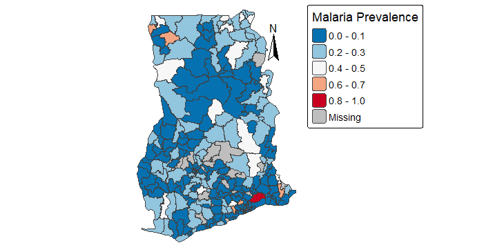
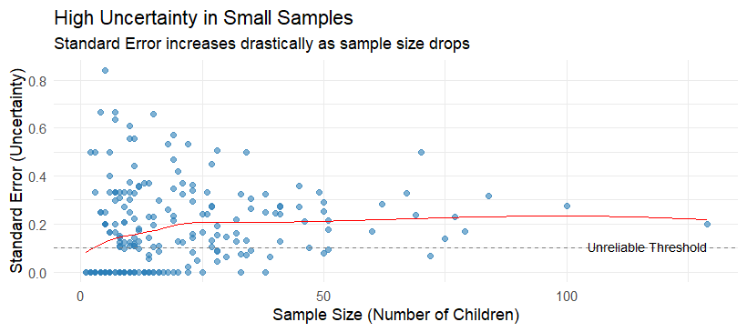
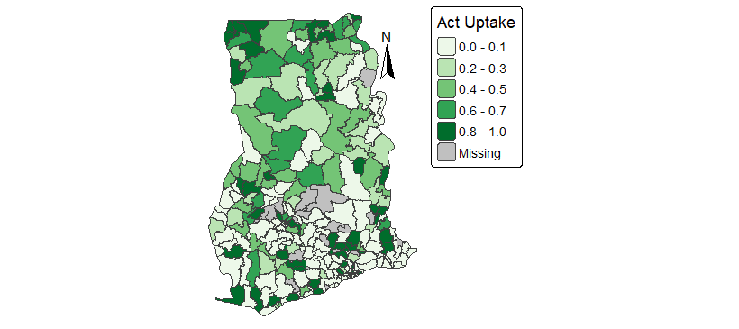

```{css, echo=FALSE}
div.logo_left{
  width: 20%;
}
div.poster_title{
  width: 80%;
}
.section h4 {
    break-after: column;
}
div.footnotes {
    font-size: 18pt;
}
```

<!-- Don't change anything above, except the title and author names, unless you know what you are doing. -->

```{r, include=FALSE}
knitr::opts_chunk$set(echo = FALSE,
                      warning = FALSE,
                      tidy = FALSE,
                      message = FALSE,
                      fig.align = 'center',
                      out.width = "100%")
options(knitr.table.format = "html") 
# Load any additional libraries here
library(tidyverse)
library(plotly)
library(kableExtra)
library(pagedown)
```

# Background and Problem

Malaria remains a public health challenge in West Africa, yet accurate data at the district level is often scarce. While Demographic and Health Surveys provide essential data on prevalence and intervention coverage, they are designed for national-level precision[^1]. When disaggregated to the district, these direct estimates rely on small sample sizes, resulting in noisy estimates with high variability[^2].

To overcome this data scarcity, we employ the Fay-Herriot model for small area Estimation. This approach borrows strength from auxiliary data, such as census demographics and climate variables to generate smoothed, robust estimates of malaria burden and intervention coverage for every district. Beyond estimation, we leverage these values to investigate the causal effect of interventions, adjusting for confounding variables to model counterfactual scenarios and project how different strategies could reduce the future malaria burden[^3].

[^1]: Corsi, D. J., Neuman, M., Finlay, J. E., & Subramanian, S.. (2012). Demographic and health surveys: a profile. International Journal of Epidemiology, 41(6), 1602–1613. https://doi.org/10.1093/ije/dys184
[^2]: Rao, Jnk, and Isabel Molina. Small Area Estimation /. Second. Hoboken, New Jersey : Wiley, 2015. Print.
[^3]: Weiss, D. J., et al. (2019). "Mapping the global prevalence, incidence, and mortality of Plasmodium falciparum, 2000–17: a spatial and temporal modelling study." The Lancet 394(10195): 322–331.

## Objectives of Project
To combine survey, census and climate data to make Small Area level estimates of malaria incidence, ACT uptake and ITN coverage in select west African countries using the Fay-Herriot model. <br>
<br>
To use the estimate obtained from SAE to estimate the casual effects of malaria interventions (ACT, ITN, Medical treatment for fever) on small area level malaria burden while adjusting for confounding variables <br>
<br>
To use the causal estimate to carry out projections based on different counter factual scenarios (e.g., if 80% of the people were sleeping under nets)
<br>
<!-- it's acting quite odd here, see if you can fix it - there's an extra bit of space above the next line if I add the page break-->
###

# Data Sources and Datasets
Primary Survey Data (DHS Program)

Environmental Predictors (Malaria Atlas Project and DHS): High-resolution raster data including precipitation, mean temperature, altitude, and proximity to water bodies.

Socio-Demographic Factors (HDX): Census-derived population density, poverty mapping, and urban/rural classifications.

Spatial Structure (DHS & WHO):Household geolocations boundaries  from the DHS and official country and Administrative Level 2 (District) boundaries from the WHO Health Geographics hub.


# Next Project Steps

**Small Area Estimation**<br>
Smooth noisy direct estimates using a Poisson regression variant of the Fay-Herriot model in R. Compare model specifications for independent versus spatial random effects to account for neighboring district similarities.

**Causal Inference** <br>
Use the smoothed small area estimates to determine the causal effect of interventions on malaria burden, adjusting for confounding variables to isolate the true impact.

**Counter factual Projections**<br>
Perform analysis to predict malaria burden under hypothetical scenarios (e.g., increasing ITN coverage to 80%) and develop an interactive Shiny App to visualize current versus projected outcomes.
###

# Early Results / Descriptive Statistics of Datasets
This map shows direct malaria incidence rate estimates in Ghana at the second administration level. 

<!--  -->


```{r, echo=FALSE, out.width="103%", fig.align="center", fig.cap="SE vs Sample Size (Malaria Prevelance)"}

```

This map shows the usage of Artemisinin based Coverage Treatment (ACT) in Ghana. 
 


# GitHub

The code and datasets for this project can be viewed at our GitHub repository here: <https://github.com/SAHagen/HDS5106>


# References


