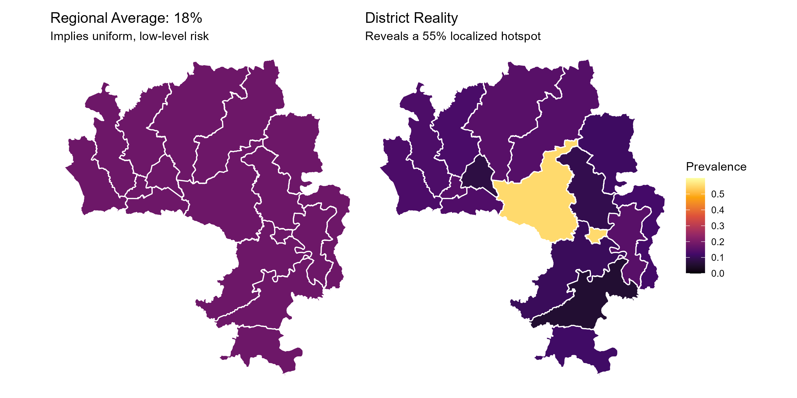
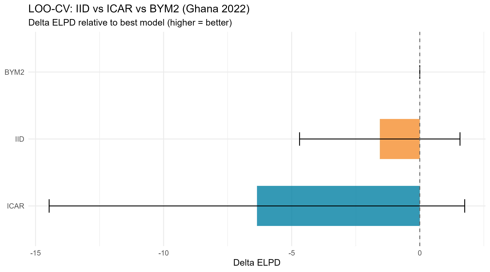
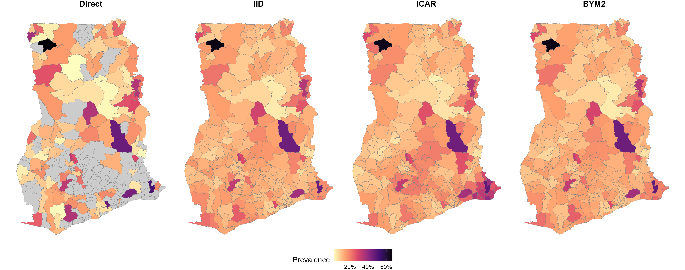
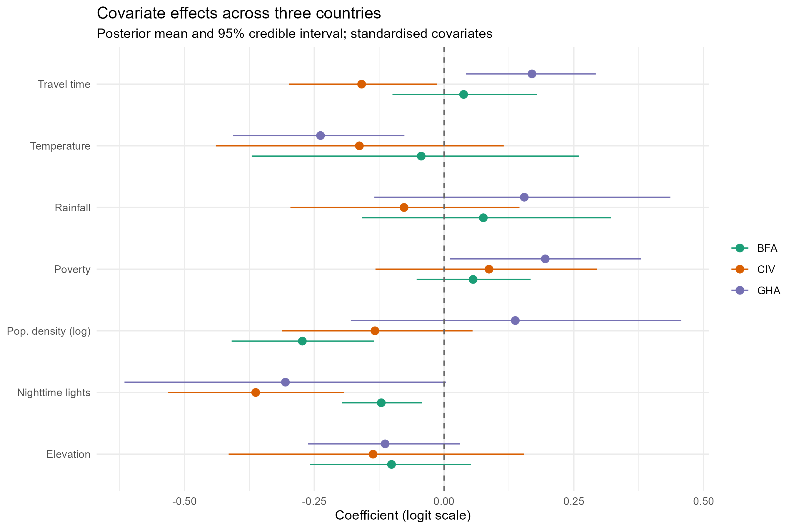

```{r setup, include=FALSE}
knitr::opts_chunk$set(
  echo    = FALSE,
  message = FALSE,
  warning = FALSE,
  fig.align = "center",
  fig.pos = "H",
  out.extra = ""
)
library(knitr)
library(kableExtra)
```

# Introduction
\label{sec:intro}

## Background

Malaria remains one of the leading causes of childhood morbidity and
mortality in sub-Saharan Africa. The World Health Organization estimated
263 million cases and 597,000 deaths globally in 2023, of which
approximately 94 per cent occurred in the African Region [@who2023].
The burden is geographically heterogeneous within countries: districts
only short distances apart can differ in prevalence by tens of
percentage points, reflecting local variation in vector ecology,
climatic suitability, intervention coverage and socioeconomic conditions
[@bhatt2015; @weiss2020]. Sub-national estimates of prevalence at the
district scale are therefore essential for targeting intervention
resources, monitoring progress against the WHO Global Technical Strategy
for Malaria 2016 to 2030 [@who2023], and evaluating the equity of
malaria control programmes.

Demographic and Health Surveys (DHS) are one of the most widely used
sources of nationally representative malaria prevalence data in
sub-Saharan Africa, with parasite rapid diagnostic tests (RDTs)
conducted on children aged 6 to 59 months in standardised survey
designs [@croft2018]. The DHS sampling design uses stratification by
administrative region and stratified two-stage cluster sampling, with
districts (admin-2 units) generally not used as explicit strata. Direct
survey-based estimates at the district level are therefore based on a
small number of clusters per district and have sampling variances too
large for reliable interpretation [@rao2015; @wakefield2020]. In our
data, many districts are sampled with too few clusters to permit a
stable design-based estimate, and a substantial number of districts are
not sampled at all in a given round. Figure \ref{fig:sampled-overview}
illustrates this for the three study countries and the two survey
rounds, and Figure \ref{fig:sampled-zoom} provides a zoomed view of
one country alongside its administrative regions to make the
granularity of the district sampling pattern apparent. The patchwork of
sampled and unsampled districts is the analytical problem this work
addresses.

```{r sampled-overview, fig.cap = "Sampled and unsampled districts by country and survey round. Sampled districts are coloured by direct estimate; unsampled districts are shown in grey. The patchy coverage at admin-2 level motivates the small area estimation framework. \\label{fig:sampled-overview}"}
knitr::include_graphics("sampled_overview_placeholder.png")
```

```{r sampled-zoom, fig.cap = "Regional and district view for one country. Left panel shows admin-1 regions; right panel shows admin-2 districts, with the patchwork of sampled (coloured) and unsampled (grey) districts within each region. \\label{fig:sampled-zoom}"}

```

## Statistical problem and motivation

Small area estimation (SAE) addresses the problem of producing reliable
estimates for areas in which the direct sample is too small to support a
stable design-based estimator. The literature distinguishes between
unit-level SAE, which models the individual response, and area-level
SAE, which models a transformed summary statistic from each area. The
Fay-Herriot model [@fay1979] is the canonical area-level approach. It
treats the design-based direct estimate from each area as a noisy
observation of an underlying true value with sampling variance treated
as known [@you2002], and links the unobserved true value to area
covariates and area-level random effects.

For prevalence outcomes, modelling on the logit scale ensures the
latent quantity respects the unit interval and gives a linear
hierarchical model [@mercer2015]. Spatial dependence between areas is
typically captured by an intrinsic conditional autoregressive (ICAR)
prior or its convolution variants [@besag1991], with the BYM2
reparameterisation of [@riebler2016] providing identifiability between
the structured and unstructured components and consistent interpretation
of the spatial standard deviation. The Bayesian implementation in Stan
[@stan2024; @morris2019] is now standard for this class of model.

This work builds and compares a sequence of Bayesian area-level SAE
models for under-five malaria prevalence across three West African
countries. Each country has been surveyed twice during the 2010 to 2022
period, giving a two-time-point space-time data structure across 724
districts. The principal methodological contribution is a careful
investigation of cross-border spatial pooling: whether and how the three
country panels should be joined on a single adjacency graph that
includes cross-border edges.

## Multi-country pooling and the cross-border question

A defining choice in this work is whether to pool the three countries on
a single combined adjacency graph that includes cross-border edges. The
substantive case for pooling is that malaria transmission ecology does
not respect national borders. *Plasmodium falciparum* dominates
transmission in West Africa and shares *Anopheles gambiae* and
*Anopheles funestus* vector species across the three study countries
[@who2023]. The West African monsoon drives a regional July to October
transmission peak and a north to south climatic gradient that the
political borders cut transversely [@bhatt2015]. Mobile human
populations disperse the parasite across borders, and the structural
determinants of risk (climate, elevation, urbanisation, accessibility)
are themselves spatially smooth across the region [@weiss2020].

At the same time, joining three countries on a single graph raises a
methodological question about the temporal alignment of the surveys.
The first survey rounds span four calendar years (Burkina Faso 2010,
Côte d'Ivoire 2012, Ghana 2014), and a spatial smoother that treats
cross-border edges in the first round as if they connected
contemporaneous surfaces would conflate spatial with temporal
variation [@saldarriaga2020]. The cross-border modelling sequence
addresses this concern through a layered strategy. A three-country
single-time model uses only the temporally aligned second survey
round, removing the temporal misalignment by construction. A
three-country two-time model extends to both rounds with
country-specific linear slopes on calendar year, following
[@wakefield2020]. Two further specifications, plus a direct
cross-border adjacency sensitivity check, test the structural
assumptions of the two-time model. The relative merits of each
specification are assessed by leave-one-out cross-validation
[@vehtari2017] and consolidated as a formal sensitivity analysis.

## Outline

Section \ref{sec:methods} sets out the data sources and statistical
methods. Section \ref{sec:results} presents the results of the seven
fitted specifications and the sensitivity comparison. Section
\ref{sec:discussion} discusses the findings, their relation to the
literature, the implications for practice, and the limitations of the
work. Section \ref{sec:conclusion} concludes.

# Methods
\label{sec:methods}

## Data

### Survey instruments and outcome

The data are drawn from the DHS programme [@croft2018]. The outcome is
the result of an RDT for *Plasmodium falciparum* infection administered
to children aged 6 to 59 months. Six DHS surveys are used in this
study (Table \ref{tab:surveys}). The administrative geography is the
second-level administrative division (admin-2), referred to as district
in Ghana and Côte d'Ivoire and as commune (Round 2) or province
(Round 1) in Burkina Faso. The harmonised country-time district panel
contains $N = 724$ districts (Ghana 260, Burkina Faso 351, Côte
d'Ivoire 113). A small number of districts changed boundaries between
rounds; these were handled by majority-area cross-walks documented in
the methodological workbook.

```{r surveys}
surveys <- data.frame(
  Country = c("Burkina Faso", "Burkina Faso",
              "Côte d'Ivoire", "Côte d'Ivoire",
              "Ghana", "Ghana"),
  `Survey round` = c("DHS 2010", "MIS 2021",
                     "DHS 2011-12", "DHS 2021",
                     "DHS 2014", "DHS 2022"),
  `Fieldwork window` = c("May 2010 to Jan 2010", "Nov 2021 to Mar 2022",
                         "Dec 2011 to May 2012", "Sep 2021 to Dec 2021",
                         "Sep 2014 to Dec 2014", "Oct 2022 to Jan 2023"),
  `Districts sampled` = c(45, 70, 33, 33, 207, 256),
  check.names = FALSE
)
knitr::kable(surveys,
             caption = "DHS surveys used in this study, by country and round. \\label{tab:surveys}",
             booktabs = TRUE) |>
  kableExtra::kable_styling(latex_options = c("hold_position", "scale_down"),
                            font_size = 8)
```

### Direct estimation and sampling variance

For each district $i$ in survey round $t$, the design-based direct
estimate of malaria prevalence is the Hájek estimator [@hajek1971],
\begin{equation}
\hat{p}_{it} = \frac{\sum_{k \in S_{it}} w_k \, m_k}{\sum_{k \in S_{it}} w_k},
\label{eq:hajek}
\end{equation}
where $S_{it}$ is the set of sampled children in district $i$ at round
$t$, $w_k$ is the survey weight of child $k$, and $m_k \in \{0, 1\}$ is
the RDT result. The Hájek estimator is preferred over the
Horvitz-Thompson estimator because the denominator is also estimated
from the survey, which reduces variability when sample sizes within
domains are small [@cochran1977; @lumley2010]. The design-based
sampling variance is computed by Taylor-series linearisation
[@binder1983] using a `svydesign` specification with primary sampling
unit and stratum information from the DHS recode files. The logit
transform $y_{it} = \mathrm{logit}(\hat{p}_{it})$ gives a quantity on
the unbounded real line; the associated sampling variance on the logit
scale follows from the delta method,
\begin{equation}
\psi_{it}^2 = \frac{\widehat{\mathrm{Var}}(\hat{p}_{it})}{[\hat{p}_{it}(1 - \hat{p}_{it})]^2}.
\label{eq:psi}
\end{equation}
Direct estimates of exactly zero or one are handled by a small
continuity adjustment; districts with zero observed clusters in a round
are flagged as unobserved and enter the model only through the spatial
and covariate structure.

### Covariates

Seven district-level covariates are included in the cross-border models.
The covariate set is selected to capture the dominant ecological and
structural determinants of malaria transmission identified in the
regional literature [@bhatt2015; @weiss2020]. Covariate values for
each district-round were extracted using the actual DHS fieldwork
months of that survey, so that seasonal variation in rainfall and
temperature is captured at the data level rather than through an
explicit seasonality term in the model. Each covariate was standardised
to unit variance and zero mean prior to model fitting.

The covariates were assembled from three distinct data sources, each
operating at a different native spatial resolution. The first source is
remote-sensed raster surfaces: elevation from the SRTM 1km digital
elevation model, rainfall from CHIRPS daily precipitation
[@weiss2020], land surface temperature from the MODIS LST product, and
nighttime lights from the VIIRS annual composite [@elvidge2014]. Each
raster was clipped to district polygons and aggregated to the district
mean (or median in the case of travel time) using the official district
boundaries. The travel-time-to-the-nearest-city covariate is taken
from the global friction surface of [@weiss2020]. Population density
is computed from the WorldPop population counts divided by district
land area, log-transformed to handle the heavy right tail.

The second source is country-specific census tabulations for the
poverty covariate. Ghana publishes a district-level multidimensional
poverty index through the Ghana Statistical Service StatsBank API at
the admin-2 level, which was queried directly for each Ghanaian
district. Burkina Faso publishes its poverty data at the regional
(admin-1) level through the *Recensement Général de la Population et
de l'Habitation* (RGPH 2019), and Côte d'Ivoire publishes its
multidimensional poverty index at the regional (admin-1) level through
the *Enquête sur le Niveau de Vie des Ménages* (ENV 2015). For these
two countries, the regional poverty value was assigned uniformly to
every district within the region.

The third source is the official admin-2 shapefile from each country
for boundary information and derived covariates. Table
\ref{tab:covariates} lists each covariate, its substantive mechanism
for the malaria-prevalence relationship and its data source. The full
data-preparation pipeline is documented in the methodological workbook.

```{r covariates}
covar_table <- data.frame(
  Covariate = c("Elevation",
                "Rainfall",
                "Temperature",
                "Nighttime lights",
                "Travel time",
                "Pop. density",
                "Poverty"),
  Mechanism = c("Altitude lowers ambient temperature and slows parasite development inside Anopheles vectors.",
                "Rainfall sustains vector breeding sites; wet-season totals are a standard environmental driver.",
                "Temperature governs vector survival and the extrinsic incubation period; optimum near 25 C.",
                "Urbanisation reduces larval habitat and improves housing and healthcare access.",
                "Accessibility from major centres reflects the practical reach of interventions and treatment.",
                "Density modifies effective transmission intensity and human-vector contact rates.",
                "Household-level deprivation drives ITN ownership, care-seeking and housing quality."),
  Source = c("SRTM 1km DEM",
             "CHIRPS daily precip.",
             "MODIS LST",
             "VIIRS composite",
             "Friction surface",
             "WorldPop + shapefile",
             "Census, district (GHA), region (BFA, CIV)"),
  Reference = c("\\citep{bhatt2015}",
                "\\citep{weiss2020}",
                "\\citep{bhatt2015}",
                "\\citep{elvidge2014}",
                "\\citep{weiss2020}",
                "\\citep{who2023}",
                "\\citep{florey2014}"),
  stringsAsFactors = FALSE,
  check.names = FALSE
)
knitr::kable(covar_table,
             caption = "Covariates used in the cross-border models. \\label{tab:covariates}",
             booktabs = TRUE, escape = FALSE) |>
  kableExtra::kable_styling(latex_options = c("hold_position", "scale_down"),
                            font_size = 7) |>
  kableExtra::column_spec(2, width = "5.5cm")
```

\paragraph{Caveat on covariate resolution.}
A material caveat applies to the poverty covariate. Ghana publishes
district-level poverty figures, but Burkina Faso and Côte d'Ivoire only
publish equivalent measures at the regional (admin-1) level. For these
two countries, the regional poverty value is assigned uniformly to
every district within the region, so within-region between-district
variation in poverty is not captured. The poverty covariate should be
interpreted as a region-level determinant for Burkina Faso and Côte
d'Ivoire and as a district-level determinant for Ghana. The other six
covariates are extracted at the district scale or finer for all three
countries. The implication of this caveat is examined in Section
\ref{sec:limitations}.

### Spatial adjacency

A combined country-time-district adjacency graph $W$ was constructed by
identifying districts that share a common border. The graph has
$N = 724$ nodes and $E = 2{,}056$ edges in total, of which 1,978 are
within-country edges and 78 are cross-border edges. The BYM2 scaling
factor [@riebler2016] was computed on this combined graph for the full
cross-border specifications and on the disconnected within-country
subgraph (with one component per country) for the within-country-only
sensitivity model, following [@freni2018].

## Statistical framework

### Fay-Herriot likelihood

The Fay-Herriot likelihood [@fay1979] treats the logit-transformed
direct estimate as a noisy observation of an underlying true latent
quantity:
\begin{equation}
y_{it} \sim \mathcal{N}(\theta_{it}, \psi_{it}^2).
\label{eq:lik}
\end{equation}
The sampling variance $\psi_{it}^2$ is treated as known following
[@you2002]. The linking model decomposes the latent quantity as
\begin{equation}
\theta_{it} = \mu + \alpha_{c[i]} + b_i + \eta_{c[i], t} + \gamma_{it}
              + \mathbf{x}_{it}^{\top}\bm{\beta}_{c[i]},
\label{eq:link}
\end{equation}
where $\mu$ is the global intercept, $\alpha_c$ is a country deviation
identified by $\sum_c \alpha_c = 0$, $b_i$ is the district-level
spatial random effect, $\eta_{c,t}$ is the temporal component
(parameterised differently across models), $\gamma_{it}$ is an
unstructured space-time interaction, and $\bm{\beta}_c$ is a vector of
country-specific covariate slopes. The country-specific covariate
slopes are partially pooled across countries through the hierarchical
prior $\beta_{c,k} \sim \mathcal{N}(\bar\beta_k, \tau_k^2)$
[@gelman2006].

### BYM2 spatial prior

Spatial dependence between districts is modelled by the BYM2 prior
[@riebler2016], a reparameterisation of the convolution model of
[@besag1991]. The district-level spatial term is
\begin{equation}
b_i = \sigma_b\!\left(\sqrt{1-\phi}\,v_i + \sqrt{\phi/s}\,u_i\right),
\label{eq:bym2}
\end{equation}
with $v_i \sim \mathcal{N}(0, 1)$ the unstructured Gaussian component
and $u \sim \mathrm{ICAR}(W)$ the structured intrinsic conditional
autoregressive component on the adjacency matrix $W$. The ICAR density
is
\begin{equation}
p(u \mid W) \propto
   \exp\!\left(-\tfrac{1}{2}\sum_{(i,j) \in E}(u_i - u_j)^2\right),
\end{equation}
where $E$ is the set of edges of $W$. The sum-to-zero constraint
$\sum_i u_i = 0$ identifies $u$. The scaling factor $s$ is computed
from the generalised inverse of the structure matrix following
[@riebler2016] so that $\sigma_b$ has consistent marginal-SD
interpretation regardless of the adjacency structure. For graphs with
multiple disconnected components the scaling factor is computed per
component [@freni2018]. The mixing parameter $\phi \in (0, 1)$ governs
the relative contribution of structured and unstructured spatial
variation: $\phi = 0$ recovers a pure IID specification and $\phi = 1$
recovers a pure ICAR specification; treating $\phi$ as an unknown
parameter lets the data determine the mixture [@morris2019].

### Priors

Weakly informative priors are used throughout, with the priors on the
spatial standard deviation following the penalised-complexity (PC)
framework of [@simpson2017]. The shared prior specification across the
cross-border models is given in Table \ref{tab:priors}.

```{r priors}
priors <- data.frame(
  Parameter = c("$\\mu$", "$\\alpha_c$ (free)", "$\\sigma_b$",
                "$\\phi$", "$\\sigma_\\gamma$", "$\\bar\\beta_k$",
                "$\\tau_k$", "$\\bar\\delta$", "$\\sigma_\\delta$"),
  Prior = c("$\\mathcal{N}(-1.85, 1.5^2)$", "$\\mathcal{N}(0, 1.5^2)$",
            "$\\mathrm{Exp}(4.6)$", "$\\mathrm{Beta}(3, 2)$",
            "$\\mathrm{Exp}(2)$", "$\\mathcal{N}(0, 1)$",
            "$\\mathrm{Exp}(2)$", "$\\mathcal{N}(0, 0.5^2)$",
            "$\\mathrm{Exp}(5)$"),
  Rationale = c("Centred on logit of moderate paediatric prevalence",
                "Identifies free elements under sum-to-zero",
                "PC, $P(\\sigma_b > 1) \\approx 0.01$",
                "Mild preference for structured component",
                "PC on space-time interaction SD",
                "Weakly informative on standardised covariates",
                "PC on between-country slope SD",
                "Tight on regional annual rate of change",
                "PC on between-country slope variation"),
  Source = c("\\citep{gelman2006}", "\\citep{gelman2006}", "\\citep{simpson2017}",
             "\\citep{morris2019}", "\\citep{simpson2017}", "\\citep{gelman2006}",
             "\\citep{simpson2017}", "\\citep{wakefield2020}", "\\citep{simpson2017}"),
  stringsAsFactors = FALSE,
  check.names = FALSE
)
knitr::kable(priors,
             caption = "Prior distributions for the shared parameters across the cross-border models. \\label{tab:priors}",
             booktabs = TRUE, escape = FALSE) |>
  kableExtra::kable_styling(latex_options = c("hold_position"), font_size = 8)
```

### Computation and diagnostics

All models were fitted in Stan version 2.34 [@stan2024] via the
`cmdstanr` interface, using the No-U-Turn Sampler [@hoffman2014]. Four
chains were run in parallel with 1,500 warmup and 2,000 sampling
iterations each. Cross-sectional and country-level models used
`adapt_delta = 0.99` and `max_treedepth = 14`; cross-border models used
`adapt_delta = 0.97` and `max_treedepth = 13`. Convergence was assessed
by the rank-normalised $\hat{R}$ of [@vehtari2021], bulk and tail
effective sample sizes, the number of divergent transitions reported
by the sampler, and visual inspection of trace, rank and pairs plots.
Non-centred parameterisations were used for all hierarchical components
to mitigate funnel geometry [@betancourt2015]. Model comparison used
approximate leave-one-out cross-validation [@vehtari2017] via the
Pareto-smoothed importance sampling implementation in the `loo`
package.

## Model sequence

This section sets out the full mathematical specification of each model
fitted. The notation is shared throughout: $i$ indexes districts,
$t \in \{1, 2\}$ indexes survey rounds, $c \in \{1, 2, 3\}$ indexes
countries ($c = 1$ Ghana, $c = 2$ Côte d'Ivoire, $c = 3$ Burkina Faso),
and $k$ indexes covariates.

### Model 1: Cross-sectional Ghana baseline

Model 1 fits the Fay-Herriot likelihood to Ghana 2022 alone, in three
variants distinguished by the spatial prior. The common likelihood and
linking model is
\begin{equation}
y_i \sim \mathcal{N}(\theta_i, \psi_i^2), \quad
\theta_i = \mu + b_i + \mathbf{x}_i^{\top}\bm{\beta},
\end{equation}
with $\mathbf{x}_i$ the standardised seven-covariate vector for
district $i$. The variants differ in the form of $b_i$: IID with
$b_i \sim \mathcal{N}(0, \sigma_b^2)$, pure ICAR with
$b_i \sim \mathrm{ICAR}(W_{\text{GHA}})$, and BYM2 with $b_i$ as in
equation \ref{eq:bym2}. The three variants are compared by LOO-CV
[@vehtari2017] to motivate the spatial prior choice for the subsequent
models.

### Model 2: Country-level space-time models

Model 2 fits a country-specific Fay-Herriot space-time model
independently to each country. For country $c$,
\begin{equation}
\theta_{it} = \mu_c + b_i + \delta_{c,t} + \gamma_{it} + \mathbf{x}_{it}^{\top}\bm{\beta}_c,
\end{equation}
where $\delta_{c, 1} = 0$ identifies $\mu_c$ as the Round 1 mean and
$\delta_{c, 2}$ is the round-to-round shift on the logit scale,
$\gamma_{it} \sim \mathcal{N}(0, \sigma_\gamma^2)$ is an unstructured
space-time interaction following the Type I classification of
[@knorrheld2000], and $b_i$ is BYM2 with country-specific scaling
factor on the within-country adjacency graph.

### Model 3: Three-country single-time

Model 3 is the first cross-border model. It joins all three countries
on the combined 724-district adjacency graph $W$ but uses only the
temporally aligned second survey round (Burkina Faso 2021, Côte
d'Ivoire 2021, Ghana 2022). With every district surveyed within a
one-year window, cross-border smoothing operates on contemporaneous
surfaces by construction:
\begin{equation}
\theta_i = \mu + \alpha_{c[i]} + b_i + \mathbf{x}_i^{\top}\bm{\beta}_{c[i]},
\end{equation}
with $b_i$ BYM2 on $W$, $\sum_c \alpha_c = 0$, and
$\beta_{c,k} \sim \mathcal{N}(\bar\beta_k, \tau_k^2)$.

### Model 4: Three-country two-time, calendar year

Model 4 extends Model 3 to both rounds. The temporal effect is
parameterised as a linear slope on the actual calendar year of each
survey, centred at 2016:
\begin{equation}
\theta_{it} = \mu + \alpha_{c[i]} + b_i + \delta_{c[i]} \cdot \widetilde{\text{yr}}_{it}
                 + \gamma_{it} + \mathbf{x}_{it}^{\top}\bm{\beta}_{c[i]},
\label{eq:m4}
\end{equation}
with $\widetilde{\text{yr}}_{it} = \text{yr}_{it} - 2016$ and
$\delta_c \sim \mathcal{N}(\bar\delta, \sigma_\delta^2)$. This
parameterisation follows the discrete spatio-temporal framework of
[@wakefield2020] in which temporal effects represent calendar-time
rates of change rather than wave-to-wave jumps; the between-round odds
ratio for country $c$ is $\exp(\delta_c \cdot \Delta\text{yr}_c)$ where
$\Delta\text{yr}_c$ is the country's actual elapsed years. The single
time-invariant BYM2 spatial field assumes that the residual spatial
structure within each country is stable across the 2010 to 2022
window. This assumption is empirically tested in Model 4a, in the
edge-deletion sensitivity, and in Model 4b.

### Model 4a: Time-varying covariate slopes

Model 4a relaxes the time-invariance of the covariate slopes in Model 4:
\begin{equation}
\theta_{it} = \mu + \alpha_{c[i]} + b_i + \delta_{c[i]} \cdot \widetilde{\text{yr}}_{it}
                 + \gamma_{it} + \mathbf{x}_{it}^{\top}\bm{\beta}_{c[i], t[i]},
\end{equation}
with $\beta_{c, t, k} \sim \mathcal{N}(\bar\beta_k, \tau_k^2)$, giving
42 slope parameters partially pooled around seven regional means. The
substantive question is whether the covariate-prevalence relationships
are stable across the study window at district scale, or whether they
have shifted between rounds.

### Model 4b: Country-specific BYM2 components

Model 4b replaces the shared BYM2 hyperparameters of Model 4 with
country-specific ones, following the disconnected-graph framework of
[@freni2018] and the country-specific BYM2 implementation of
[@donegan2021]. The cross-border edges are removed from the adjacency
graph, and each country gets its own variance $\sigma_{b,c}$ and
mixing parameter $\phi_c$:
\begin{equation}
b_i = \sigma_{b, c[i]}\!\left(\sqrt{1 - \phi_{c[i]}}\,v_i
        + \sqrt{\phi_{c[i]} / s_{c[i]}}\,u_i\right),
\end{equation}
with $u$ ICAR on the within-country adjacency $W'$, per-country
sum-to-zero $\sum_{i \in c} u_i = 0$, and per-country scaling factor
$s_c$. The substantive question is whether the three countries have
materially different residual spatial structures.

### Edge-deletion sensitivity

A direct sensitivity analysis to the cross-border edges themselves
follows [@earnest2007]: Model 4 is refitted with the cross-border
edges removed but with the BYM2 hyperparameters held constant. This
isolates the contribution of the 78 cross-border edges, holding the
rest of the specification fixed. The scaling factor is computed per
component [@freni2018] and applied per district.

## Model comparison

Models within comparable observation blocks are compared by approximate
leave-one-out cross-validation [@vehtari2017]. The expected log
predictive density (ELPD) is the criterion; larger ELPD indicates
better expected predictive performance. Differences in ELPD between
models are compared against the standard error of the difference; a
difference smaller than two standard errors is considered not
statistically distinguishable from zero [@vehtari2017]. Comparisons
are only made between models fitted to the same set of observations.

# Results
\label{sec:results}

## Cross-sectional baseline: motivating the BYM2 prior

The three Ghana 2022 cross-sectional variants converged with all
parameters showing $\hat{R} < 1.02$ and bulk effective sample sizes
above 300. The LOO-CV comparison is summarised in Figure
\ref{fig:loo-cv-comparison}. The BYM2 specification achieves the best
ELPD with an estimate of $-104.3$ (SE 7.9). The IID specification is
2.7 ELPD units behind (SE 1.8), and the pure ICAR specification is 8.9
ELPD units behind (SE 4.2). The ICAR penalty exceeds two standard
errors, so the data provide clear evidence against the pure ICAR prior
at this scale; the IID alternative is within 1.5 standard errors of
BYM2, but the BYM2 parameter estimates indicate that the data prefer a
substantial structured component. The BYM2 prior is adopted as the
spatial prior for all subsequent models.

```{r loo-cv-comparison, fig.cap = "Leave-one-out cross-validation comparison of three spatial priors on the Ghana 2022 cross-section. Bars show the ELPD difference relative to the best model with two-standard-error intervals. The BYM2 prior is preferred over the IID alternative and substantially over the pure ICAR alternative. \\label{fig:loo-cv-comparison}", out.width = "80%"}

```

The Model 1 BYM2 posterior estimates of the structural parameters are
$\mu = -1.82$ (90 per cent CrI $[-2.02, -1.62]$), $\sigma_b = 0.88$
$[0.68, 1.15]$, and $\phi = 0.44$ $[0.17, 0.72]$. The marginal
national prevalence is $p^{\text{nat}} = 14.1$ per cent
$[11.8, 16.5]$, consistent with the direct national estimate for
Ghana 2022. The maps of direct, IID, ICAR and BYM2 estimates for Ghana
2022 are shown in Figure \ref{fig:m1-maps}. The BYM2 surface
reproduces the broad north-to-south gradient visible in the direct
estimates while filling in the unsampled districts with spatially
coherent predictions.

```{r m1-maps, fig.cap = "Model 1 estimated under-five malaria prevalence for Ghana 2022: direct (top-left), IID (top-right), ICAR (bottom-left), BYM2 (bottom-right). Districts with no observed clusters are shown in white in the direct panel and filled by the model in the model-based panels. \\label{fig:m1-maps}"}

```

## Country-level space-time models

The country-level Model 2 fits converged for all three countries with
$\hat{R} < 1.01$ for all top-level parameters and bulk effective sample
sizes between 600 and 5,500. The key parameter estimates are summarised
in Table \ref{tab:m2-params} and the implied national prevalence
trajectories are shown in Table \ref{tab:m2-prev}.

```{r m2-params}
m2 <- data.frame(
  Country = c("GHA", "BFA", "CIV"),
  `$\\mu$` = c("-0.83 [-0.94, -0.71]", "0.91 [0.74, 1.07]", "-1.56 [-1.75, -1.38]"),
  `$\\sigma_b$` = c("0.72 [0.56, 0.94]", "1.04 [0.78, 1.36]", "0.82 [0.55, 1.23]"),
  `$\\phi$` = c("0.47 [0.20, 0.73]", "0.64 [0.37, 0.84]", "0.59 [0.25, 0.87]"),
  `$\\sigma_\\gamma$` = c("0.52 [0.45, 0.59]", "0.51 [0.45, 0.58]", "0.48 [0.40, 0.56]"),
  `$\\delta_2$` = c("-1.14 [-1.30, -0.98]", "-2.52 [-2.82, -2.19]", "0.78 [0.50, 1.06]"),
  check.names = FALSE
)
knitr::kable(m2,
             caption = "Model 2 (country-level space-time) posterior estimates of structural parameters. Posterior median with 90 per cent CrI. \\label{tab:m2-params}",
             booktabs = TRUE, escape = FALSE) |>
  kableExtra::kable_styling(latex_options = c("hold_position"), font_size = 8)
```

```{r m2-prev}
prev <- data.frame(
  Country = c("GHA", "BFA", "CIV"),
  `Round 1` = c("30.5\\% [28.1, 33.1]", "71.2\\% [67.7, 74.5]", "17.4\\% [14.8, 20.1]"),
  `Round 2` = c("12.3\\% [10.9, 13.8]", "16.8\\% [14.3, 19.5]", "31.3\\% [27.9, 34.8]"),
  `Odds ratio R2/R1` = c("0.32", "0.08", "2.13"),
  check.names = FALSE
)
knitr::kable(prev,
             caption = "Implied national paediatric prevalence by round, country-level Model 2. Posterior medians with 90 per cent CrI. \\label{tab:m2-prev}",
             booktabs = TRUE, escape = FALSE) |>
  kableExtra::kable_styling(latex_options = c("hold_position"), font_size = 8)
```

The country-level models show three different trajectories. Ghana
declined from 30.5 per cent in 2014 to 12.3 per cent in 2022, an odds
ratio of 0.32. Burkina Faso showed the largest decline in absolute
terms, from 71.2 per cent in 2010 to 16.8 per cent in 2021, with the
largest country-level $\sigma_b$ reflecting substantial residual
heterogeneity across districts. Côte d'Ivoire showed an increase from
17.4 to 31.3 per cent between 2012 and 2021. Figure
\ref{fig:m2-covariates} shows the posterior covariate effect estimates
from the three country-level models.

```{r m2-covariates, fig.cap = "Covariate effects from the three country-level (Model 2) specifications. Points are posterior means with 90 per cent credible intervals; asterisks denote covariates whose credible interval excludes zero. \\label{fig:m2-covariates}"}
knitr::include_graphics("individual_covariate_effects.png")
```

## Three-country cross-border models

The four cross-border specifications were fitted to the full
district-round panel. Their key structural parameters are summarised in
Table \ref{tab:m4-family}.

```{r m4-family}
m4f <- data.frame(
  Parameter = c("$\\mu$", "$\\sigma_b$", "$\\phi$", "$\\sigma_\\gamma$",
                "$\\delta_{\\text{GHA}}$", "$\\delta_{\\text{CIV}}$", "$\\delta_{\\text{BFA}}$",
                "$\\bar\\beta_{\\text{NTL}}$"),
  `Model 4` = c("-1.14 [-1.33, -0.95]",
                "0.66 [0.40, 0.91]",
                "0.85 [0.57, 0.96]",
                "0.71 [0.66, 0.76]",
                "-0.143 [-0.166, -0.120]",
                "0.080 [0.049, 0.110]",
                "-0.230 [-0.255, -0.206]",
                "-0.19 [-0.43, 0.04]"),
  `Model 4a` = c("-1.15 [-1.34, -0.95]",
                 "0.70 [0.45, 0.91]",
                 "0.86 [0.63, 0.97]",
                 "0.70 [0.64, 0.75]",
                 "-0.137 [-0.163, -0.118]",
                 "0.076 [0.047, 0.106]",
                 "-0.232 [-0.254, -0.205]",
                 "-0.17 [-0.27, 0.10]"),
  `Edge-del` = c("-0.68 [-1.32, 0.27]",
                  "0.49 [0.25, 0.72]",
                  "0.79 [0.46, 0.95]",
                  "0.73 [0.67, 0.78]",
                  "-0.142 [-0.165, -0.118]",
                  "0.079 [0.049, 0.110]",
                  "-0.233 [-0.256, -0.210]",
                  "-0.19 [-0.43, 0.10]"),
  `Model 4b` = c("-1.02 [-1.27, -0.42]",
                 "see note",
                 "see note",
                 "0.72 [0.67, 0.77]",
                 "-0.142 [-0.166, -0.120]",
                 "0.080 [0.050, 0.108]",
                 "-0.229 [-0.254, -0.205]",
                 "-0.21 [-0.46, 0.07]"),
  check.names = FALSE,
  stringsAsFactors = FALSE
)
knitr::kable(m4f,
             caption = "Cross-border model family: key structural parameter estimates. Posterior medians with 90 per cent CrI. Model 4b has per-country spatial parameters: $\\sigma_b = (0.15, 0.11, 0.66)$ and $\\phi = (0.62, 0.63, 0.72)$ for GHA, CIV, BFA respectively. \\label{tab:m4-family}",
             booktabs = TRUE, escape = FALSE) |>
  kableExtra::kable_styling(latex_options = c("hold_position", "scale_down"), font_size = 7) |>
  kableExtra::column_spec(2:5, width = "3cm")
```

### Headline findings from Model 4

The Model 4 estimates are consistent with Model 2 in sign and
approximate magnitude. The global intercept is $\mu = -1.14$ on the
logit scale. The spatial standard deviation $\sigma_b = 0.66$ is well
identified, and the mixing parameter $\phi = 0.85$ indicates that the
residual spatial variation is predominantly structured. The
country-year slopes recover the three trajectories at calendar-year
scale: Ghana $\delta = -0.143$ $[-0.166, -0.120]$ per year; Côte
d'Ivoire $\delta = +0.080$ $[0.049, 0.110]$ per year; Burkina Faso
$\delta = -0.230$ $[-0.255, -0.206]$ per year. The implied
between-round odds ratios are 0.32 for Ghana (8-year window), 2.09 for
Côte d'Ivoire (9-year window) and 0.08 for Burkina Faso (11-year
window), all consistent with Model 2. The strongest regional
protective effect is for nighttime lights with $\bar\beta = -0.19$,
followed by population density at $-0.18$ and temperature at $-0.14$.
Elevation, rainfall and travel time have regional credible intervals
that span zero, and poverty has a regional median of $+0.09$.

### Model 4a: time-varying covariate slopes

Model 4a's structural parameters are nearly identical to Model 4's, and
the country-year slopes recover the same trajectories. The Round 1
versus Round 2 covariate slopes are stable for almost all of the 21
country-covariate pairs. The largest changes between rounds are seen
in the Ghana temperature slope (R1 $-0.22$, R2 $-0.11$) and Ghana
population density slope (R1 $-0.22$, R2 $-0.14$), but in both cases
the Round 2 credible intervals widen and the change is within the
noise. Figure \ref{fig:m4a-betas} displays the time-varying slopes.

```{r m4a-betas, fig.cap = "Model 4a country-specific covariate slopes by survey round. Posterior medians with 90 per cent credible intervals. Time-varying slopes are largely consistent across rounds for the same country-covariate pair. \\label{fig:m4a-betas}"}

```

### Edge-deletion sensitivity

Removing the 78 cross-border edges and re-fitting Model 4 yields the
edge-deletion specification. The country-year slopes are essentially
unchanged ($\delta_{\text{GHA}} = -0.142$, $\delta_{\text{CIV}} =
0.079$, $\delta_{\text{BFA}} = -0.233$), as are the regional covariate
effects. The spatial standard deviation drops from $\sigma_b = 0.66$
to $\sigma_b = 0.49$, reflecting that some of the spatial variation
previously absorbed by the cross-border smoothing is redistributed
into the unstructured Gaussian term and the country intercepts, with
the global intercept becoming weakly identified at $\mu = -0.68$. The
mixing parameter $\phi = 0.79$ remains high.

### Model 4b: country-specific BYM2 components

Model 4b yields country-specific spatial standard deviations of
$\sigma_{b,\text{GHA}} = 0.15$, $\sigma_{b,\text{CIV}} = 0.14$ and
$\sigma_{b,\text{BFA}} = 0.66$. Burkina Faso shows substantially
larger residual spatial variation than the other two countries,
consistent with its larger country-level Model 2 $\sigma_b$. The
country-specific mixing parameters are $\phi_{\text{GHA}} = 0.61$,
$\phi_{\text{CIV}} = 0.63$ and $\phi_{\text{BFA}} = 0.72$, all
indicating predominantly structured residual variation. The
country-year slopes are again essentially unchanged from Model 4.

## Sensitivity comparison: LOO across the cross-border models

Table \ref{tab:sens-loo} presents the leave-one-out cross-validation
comparison across the four cross-border two-time specifications, all
fitted on the same observation set so the comparison is valid in the
sense of [@vehtari2017].

```{r sens-loo}
sens <- data.frame(
  Model = c("Model 4a (time-varying betas)",
            "Edge-deletion (within-country only)",
            "Model 4 (shared BYM2, full graph)",
            "Model 4b (country-specific BYM2)"),
  `ELPD diff` = c(0.0, -2.3, -3.4, -5.9),
  `SE diff` = c(0.0, 4.9, 4.9, 5.3),
  ELPD = c(-465.2, -467.5, -468.6, -471.2),
  `SE(ELPD)` = c(21.2, 21.3, 21.1, 21.5),
  check.names = FALSE
)
knitr::kable(sens,
             caption = "Leave-one-out cross-validation across the cross-border two-time models. ELPD difference is computed against the best model; differences smaller than two standard errors are not statistically distinguishable from zero \\citep{vehtari2017}. \\label{tab:sens-loo}",
             booktabs = TRUE, escape = FALSE) |>
  kableExtra::kable_styling(latex_options = c("hold_position"), font_size = 8)
```

Model 4a achieves the best ELPD by a small margin. Model 4 is 3.4 ELPD
units behind Model 4a with a standard error of 4.9 units (0.7 standard
errors). The edge-deletion specification is 2.3 ELPD units behind (0.5
standard errors), and Model 4b is 5.9 ELPD units behind with a
standard error of 5.3 (1.1 standard errors). All four specifications
are within 6 ELPD units of each other against standard errors of
around 5, and none of the three structural relaxations of Model 4
produces a detectable improvement in expected predictive performance.

# Discussion
\label{sec:discussion}

## Headline findings

The Bayesian space-time Fay-Herriot framework with BYM2 spatial prior
produced district-level estimates of under-five malaria prevalence for
Burkina Faso, Côte d'Ivoire and Ghana over two DHS rounds spanning the
2010 to 2022 period. The cross-sectional baseline confirmed that the
BYM2 prior is preferred over the IID and ICAR alternatives by LOO-CV,
supporting its use across the subsequent models. The country-level and
three-country specifications agree on three distinct trajectories.
Ghana and Burkina Faso showed substantial declines, with Burkina Faso's
decline the largest in absolute terms (from 71 to 17 per cent), while
Côte d'Ivoire showed an increase from 17 to 31 per cent between 2012
and 2021. The headline cross-border specification (Model 4) recovers
these trajectories on a calendar-year scale with country-specific
annual rates of change.

The mixing parameter $\phi$ from Model 4 is 0.85 with credible interval
well above 0.5, indicating that the residual spatial variation after
conditioning on the seven structural covariates is predominantly
structured. This is consistent with the substantive expectation that
the structural covariates capture the broad regional gradient and the
spatial residual reflects unmeasured but spatially smooth factors such
as intervention history, housing quality and vector species
composition.

## Sensitivity analysis and the cross-border assumption

Three structural relaxations of Model 4 were fitted as sensitivity
specifications. Model 4a allows covariate slopes to differ between
rounds, testing the time-invariance assumption. The Model 4
edge-deletion removes the 78 cross-border edges, testing whether
cross-border smoothing is doing useful work. Model 4b replaces the
shared BYM2 hyperparameters with country-specific ones, testing the
assumption that the three countries share spatial structure.

The LOO-CV comparison in Table \ref{tab:sens-loo} shows that none of
the three relaxations produces a detectable improvement over Model 4.
The posterior parameter comparisons in Table \ref{tab:m4-family}
reinforce this: the country-year slopes are essentially identical
across all four specifications; the regional covariate effects are
similar within Monte Carlo error; and the Round 1 versus Round 2
covariate slopes in Model 4a do not differ materially for the great
majority of country-covariate pairs. Substantively, Model 4 is
parsimoniously adequate against all three structural alternatives, and
the simpler specification is retained.

The edge-deletion result deserves attention. Removing the cross-border
edges substantially weakens identification of the global intercept $\mu$
and produces a corresponding widening of the country intercepts
$\alpha_c$, but the substantive parameters of interest (country-year
slopes, regional covariate effects, between-country slope variation)
are essentially unchanged. The cross-border edges in Model 4 are doing
identification work for the global intercept and the country intercepts,
but the data-driven findings about trajectories, covariate effects and
between-country heterogeneity do not depend on them. This is a useful
negative result: it tells us that the substantive findings are robust
to whether the spatial smoother shares information across national
borders.

## Relation to the literature

The country-specific trajectories are broadly consistent with the
published literature. The Burkina Faso decline matches the trajectory
documented in [@bhatt2015] and updated in [@weiss2020] for the
Sahelian zone, where the rollout of seasonal malaria chemoprevention
from 2014 onwards has been associated with substantial reductions in
paediatric prevalence. The Ghana decline matches the trajectory in the
country's own national malaria control programme reports through the
WHO World Malaria Report series [@who2023]. The Côte d'Ivoire increase
between 2012 and 2021 is less commonly emphasised in summary regional
reports but is consistent with the country's own DHS reports and with
the broader observation in [@weiss2020] that progress against malaria
has not been uniform across West Africa.

The methodological framework is in the tradition of
[@mercer2015; @wakefield2020] for area-level SAE of paediatric
prevalence outcomes, with the BYM2 prior of [@riebler2016] and the
disconnected-graph treatment of [@freni2018]. The multi-country
pooling on a combined adjacency graph is, to the best of our
knowledge, one of the first applications of this design in this region.

## Implications for practice

The district-level estimates produced by the model are suited to
target resource allocation for malaria intervention programmes within
each country and across the region. The substantially smaller
uncertainty of the model-based estimates compared with the direct
estimates, particularly for the many districts not directly sampled in
a given round, makes them useful as inputs to programme planning. The
between-round trajectory information from Model 4 quantifies the rate
of progress at the country level on a comparable calendar scale across
the three countries, allowing direct comparison of progress that the
round-indicator parameterisation would obscure.

## Limitations
\label{sec:limitations}

Several limitations should be borne in mind.

First, the poverty covariate is available at the district scale only
for Ghana. For Burkina Faso and Côte d'Ivoire, regional (admin-1)
poverty values were assigned uniformly to every district within the
region, so within-region variation in this covariate is not captured.
This is a known limitation of nationally available poverty data and
reflects the resolution at which the underlying surveys are designed
to be representative. The implication is that the poverty covariate
coefficient should be interpreted as a region-level determinant for
Burkina Faso and Côte d'Ivoire, and that any residual within-region
variation correlated with poverty is absorbed into the spatial random
effect.

Second, the BYM2 spatial field is assumed to be time-invariant in
Models 3, 4, 4a and 4b. The substantive justification is that the
structural drivers of the regional malaria gradient (climate,
elevation, urbanisation, accessibility) move on decadal timescales
[@bhatt2015; @weiss2020], so the spatial residual after conditioning
on the covariates should also be time-stable at the district scale
across the study window. Fitting a separate BYM2 field per round with
only two time points would be weakly identified and was not attempted.
With more survey rounds this assumption could be relaxed through the
Knorr-Held Type II or Type IV interactions [@knorrheld2000;
@goicoa2018].

Third, the sampling variance $\psi_{it}^2$ is treated as known
following the standard Fay-Herriot approach [@you2002]. For districts
with very few clusters the design-based variance estimate is itself
uncertain; the Fay-Herriot framework does not propagate this
uncertainty. Smoothing the variance estimate through a generalised
variance function is a natural extension.

Fourth, the cross-border pooling assumes that the cross-border edges
represent shared transmission ecology across borders. While there is a
strong substantive case for this from vector ecology and human
movement [@bhatt2015; @weiss2020; @who2023], the data in this
particular application do not strongly select the cross-border
specification over the within-country-only alternative. This does not
undermine the broader methodological case for cross-border pooling but
suggests that applications with longer time series or more countries
would be informative.

Fifth, external validation against the Malaria Atlas Project
[@bhatt2015; @weiss2020] surfaces was set out in the methodological
workbook but the comparison itself was not completed within this
report. The MAP comparison would provide concordance evidence with an
independently developed geostatistical modelling tradition and is the
natural next step.

# Conclusions
\label{sec:conclusion}

This work has presented a Bayesian area-level small area estimation
framework for under-five malaria prevalence across Burkina Faso, Côte
d'Ivoire and Ghana over the 2010 to 2022 period. The BYM2 spatial prior
was selected empirically over the IID and ICAR alternatives in a
cross-sectional baseline and adopted for the country-level and
cross-border models. The country-level results showed three different
trajectories: substantial declines in Burkina Faso and Ghana, and an
increase in Côte d'Ivoire, with these findings carrying over to the
cross-border specifications. The headline cross-border model (Model 4)
parameterises country-specific trajectories as annual rates of change
on calendar year, supporting direct between-country comparison.

A formal sensitivity analysis tested three structural relaxations:
time-varying covariate slopes (Model 4a), removal of cross-border
edges (edge-deletion), and country-specific BYM2 hyperparameters
(Model 4b). None produced a detectable improvement in LOO-CV, and the
substantive parameters of interest were essentially unchanged across
all four specifications. Model 4 is parsimoniously adequate against
these alternatives and is retained as the headline specification.

The findings are consistent with the published regional literature on
malaria trajectories in West Africa, and the methodological framework
provides a transparent basis for producing district-level paediatric
prevalence estimates with quantified uncertainty for the three study
countries. The framework is directly applicable to other Sahelian and
Guinean countries where the DHS RDT modules have been conducted, and
extends to other outcomes available in the DHS recode files.

# References {-}
