## Outline

::: {.two-col}
::: {}
**Part 1: The Problem**

1. The public health reality
2. Objectives and research questions
3. The missing data problem
4. The variance problem
5. Covariates and data sources

**Part 2: Methods and Results**

6. The hierarchical architecture
7. Baseline: Ghana cross-section
8. Space-time dynamics
9. Extending the ICAR across borders
10. The unified pooled model
:::

::: {}
**Part 2 continued **

11. The covariate story
12. Districts at risk
13. Uncertainty and reliability
14. Shrinkage
15. What we learned: separate vs pooled

**Part 3: Discussion**

16. Takeaways and policy action
17. Limitations and conclusion

**Appendix (A-E)**
:::
:::

---

## The Public Health Reality {.smaller}

::: {.two-col}
::: {}
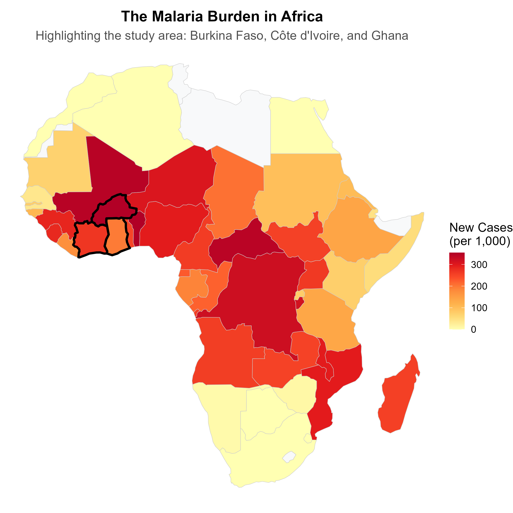{width="100%"}

::: {.xs-text .center-text}
Left: regional average (18%). Right: district-level reality (5% to 55%).
:::
:::

::: {}
In 2022, malaria killed an estimated 608,000 people, 95% in sub-Saharan Africa. Children under 5 accounted for 78% of deaths (WHO World Malaria Report 2023).

Interventions are deployed at the **district level**: seasonal malaria chemoprevention (SMC), insecticide-treated nets (ITNs), and intermittent preventive treatment in pregnancy (IPTp).

Regional averages waste resources in cold-spots and leave children unprotected in hot-spots.

::: {.info-box .small-text}
We need district-level prevalence estimates to target interventions effectively. But the surveys that produce these estimates have fundamental data quality problems.
:::
:::
:::

---

## Objectives and Research Questions {.smaller}

**Objective:** Develop and apply a Bayesian spatio-temporal small area estimation framework to produce reliable district-level estimates of under-5 malaria prevalence across three West African countries.

**Research questions:**

1. Can we produce reliable district-level estimates of under-5 malaria prevalence using BYM2 spatial priors and DHS survey data, even in districts with no direct survey observations?

2. How has prevalence changed between DHS rounds, and which districts deviate from the national temporal trend?

3. Which environmental and socio-economic covariates drive spatial variation in malaria risk, and do these relationships differ across countries?

4. Does a pooled 3-country model with cross-border spatial smoothing and hierarchical random slopes improve estimation compared to separate country models?

::: {.info-box .small-text}
**Contribution.** This work brings an established Bayesian SAE framework to a multi-country West African malaria setting and extends it to a pooled model with hierarchical country-specific covariate effects, a specification not previously applied in this context.
:::

---

## The Missing Data Problem

::: {.two-col}
::: {}
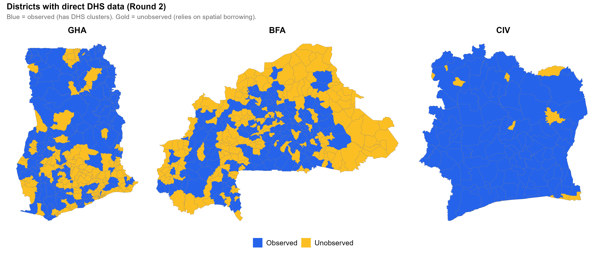{width="100%"}

::: {.xs-text .center-text}
724 districts. Blue = DHS clusters present. Gold = zero clusters (data desert).
:::

{width="100%"}

::: {.xs-text .center-text}
The Illusion of the Average: Regional metrics mask district-level hotspots.
:::
:::

::: {}
The DHS provides the gold standard for biomarker data (RDT positivity), but we are completely blind in large parts of the region.

| Country | Districts | Observed R2 | Unobserved R2 |
|---|---:|---:|---:|
| Ghana | 260 | 124 (48%) | 136 (52%) |
| Burkina Faso | 351 | ~180 (51%) | ~171 (49%) |
| Cote d'Ivoire | 113 | ~65 (58%) | ~48 (42%) |

::: {.small-text}
DHS data requires formal application and must remain confidential. Cluster GPS coordinates are displaced up to 5km (urban) or 10km (rural) for respondent protection.
:::
:::
:::

---

## The Variance Problem

::: {.center-text .muted}
Missing data is only half the problem. Even in surveyed districts, direct estimates are unreliable.
:::

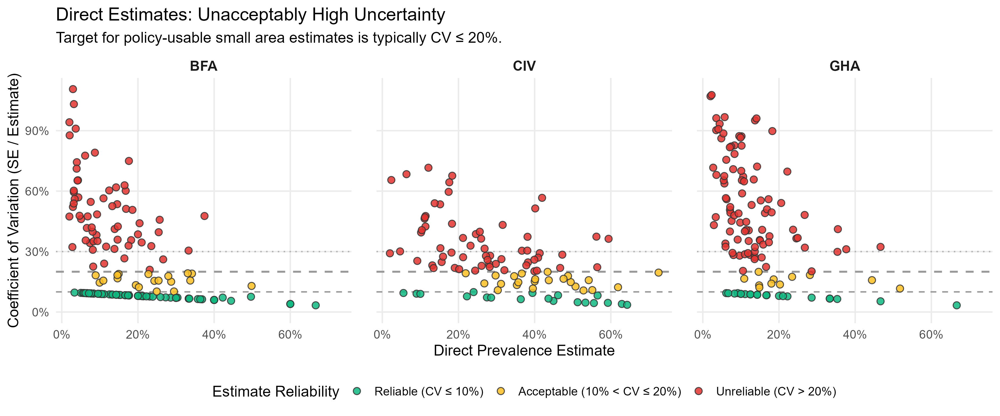{.r-stretch style="margin-left: auto; margin-right: auto; display: block;"}

::: {.info-box .small-text style="width: 85%; margin-left: auto; margin-right: auto; margin-top: 15px;"}
**The Coefficient of Variation (CV) Thresholds:** 🟩 Reliable (< 16%) &nbsp;|&nbsp; 🟨 Caution (16-33%) &nbsp;|&nbsp; 🟥 Unreliable (> 33%)

Many observed districts cross into the red zone. If the Ministry uses raw data, **statistical noise drowns out the true signal**. We need a model that fills data deserts *and* stabilizes these noisy estimates.
:::

---

## Covariates and Data Sources {.smaller}

::: {.two-col .wide-left}
::: {}
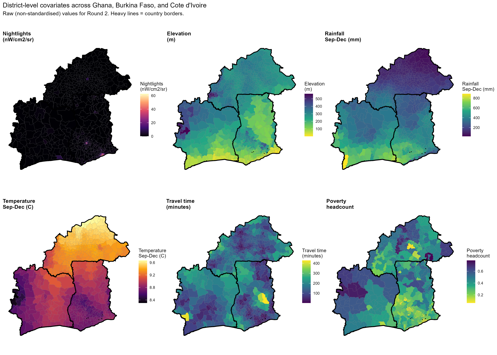{width="100%"}

::: {.xs-text .center-text}
7 covariates mapped across all 724 districts (non-standardised, Round 2 values)
:::
:::
::: {}
::: {.small-text}
| Covariate | Source | Type |
|---|---|---|
| Elevation | SRTM 30s (pop-weighted) | Static |
| Rainfall | CHIRPS v2.0 (Sep-Dec avg) | Time-varying |
| Nightlights | NASA Black Marble VIIRS | Time-varying |
| Temperature | CRU TS v4.09 (Sep-Dec) | Time-varying |
| Travel time | Weiss/MAP 2020 (pop-wt) | Static |
| Pop density | National census (log) | Static |
| MPI poverty | Census/HDX headcount | Static |
:::

::: {.xs-text .muted}
**Processing:** Elevation and travel time rasters were population-weighted and averaged to district level. Rainfall was matched to DHS fieldwork window; missing districts assigned regional means. District boundaries from GADM v4.1 (Level 2 for Ghana, Level 3 for BFA/CIV). All covariates standardised within each country; pairwise correlations < 0.7 (Dormann et al. 2013).
:::

::: {.xs-text .muted}
**Abbreviations:** 

- SRTM = Shuttle Radar Topography Mission. 
- CHIRPS = Climate Hazards Group InfraRed Precipitation with Station data. 
- VIIRS = Visible Infrared Imaging Radiometer Suite. 
- CRU TS = Climatic Research Unit Time-Series. 
- MAP = Malaria Atlas Project. 
- MPI = Multidimensional Poverty Index.
- HDX = Humanitarian Data Exchange. 
- GADM = Global Administrative Areas Database.
:::
:::
:::

::: {.xs-text .muted}
All standardised within each country. Pairwise correlations < 0.7 (Dormann et al. 2013). DHS data: cluster-level RDT positivity among children 6-59 months.
:::

---

## The Hierarchical Architecture {.smaller}

::: {.center-text .xs-text .muted style="margin-bottom: 15px;"}
Each row adds complexity only when mathematically justified by the sparse data.
:::

**Fay-Herriot likelihood** (propagates design-based survey uncertainty):
$$y_{it} \sim N(\theta_{it},\; \psi_{it}^2) \qquad \text{where } \psi_{it} \text{ is the known sampling SE}$$

**Model 1, cross-sectional** (Ghana 2022, baseline):
$$\theta_i = \mu + b_i + \mathbf{x}_i^\top \boldsymbol{\beta} \qquad b_i = \sigma_b\left(\sqrt{1-\varphi}\,v_i + \sqrt{\varphi/s}\,u_i\right)$$

::: {.center-text .muted .small-text style="margin: 10px 0;"}
$\downarrow$ *Add national temporal shift ($\delta_t$) and Knorr-Held local shocks ($\gamma_{it}$)* $\downarrow$
:::

**Model 2, space-time** (Knorr-Held Type I, per country):
$$\theta_{it} = \mu + b_i + \delta_t + \gamma_{it} + \mathbf{x}_{it}^\top \boldsymbol{\beta}$$

::: {.center-text .muted .small-text style="margin: 10px 0;"}
$\downarrow$ *Pool 3 countries using hierarchical random slopes ($\beta_c$) and intercepts ($\alpha_c$)* $\downarrow$
:::

**Model 3, pooled 3-country** (hierarchical random slopes):
$$\theta_{it} = \mu + \alpha_{c[i]} + b_i + \delta_{c[i],t} + \gamma_{it} + \mathbf{x}_{it}^\top \boldsymbol{\beta}_{c[i]} \qquad \beta_{ck} \sim N(\bar{\beta}_k, \tau_k)$$

::: {.info-box .xs-text style="margin-top: 15px;"}
**Key components:** $b_i$: BYM2 spatial effect (Riebler et al. 2016). $\varphi$: fraction spatially structured. $\gamma_{it}$: area-time interaction. $\tau_k$: between-country covariate shrinkage.
:::

---

## Establishing the Baseline: Ghana Cross-Section {.smaller}

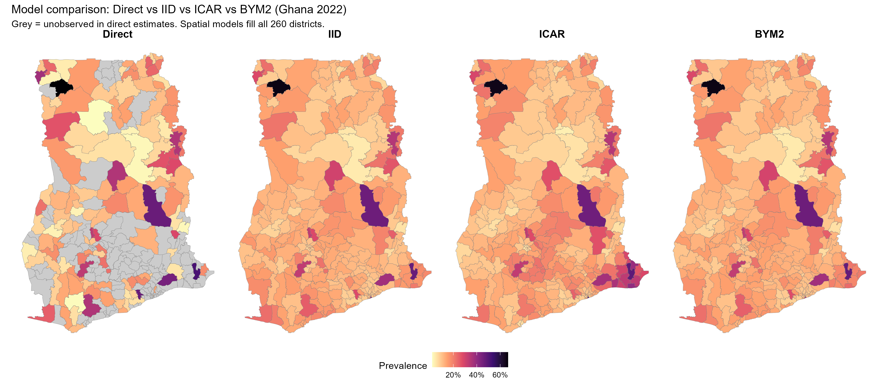{fig-align="center" width="70%"}

::: {.two-col}
::: {}
::: {.small-text}
| Model | ELPD | Delta (SE) | $\varphi$ | $\sigma_b$ | p_loo |
|---|---:|---:|---:|---:|---:|
| **IID** | -103.7 | 0.0 | -- | 0.68 | 66.8 |
| **BYM2** | -108.5 | -4.8 (1.8) | 0.47 | 0.72 | 71.4 |
| **ICAR** | -113.1 | -9.4 (4.5) | 1.0 | 0.81 | 72.8 |

**Significant covariates (BYM2):** travel time (+)

Direct estimates (top-left) leave 136 districts in Ghana blank. The three models successfully resolves this by estimating all 260 districts, borrowing strength from both covariates and neighboring regions.
:::
:::

::: {}
::: {.small-text}
While the IID model shows a better ELPD score we explicitly retain the BYM2 architecture despite this metric for two reasons:

1. **Epidemiological Reality:** An IID model assumes vector-borne disease risk does not cross arbitrary district borders. Our posterior estimate of $\varphi = 0.47$ proves that roughly half the residual variance is spatially structured.
2. **The Interpolation Mandate:** The primary goal of this model is to rescue "data deserts". The BYM2 model can estimate the 136 unobserved districts by looking at their neighbors and an IID model cannot do this; it would naively shrink all unobserved districts to a generic national mean, erasing all local geography.
:::
:::
:::

---

## Space-Time Dynamics {.smaller}

:::: {.columns}

::: {.column width="55%"}
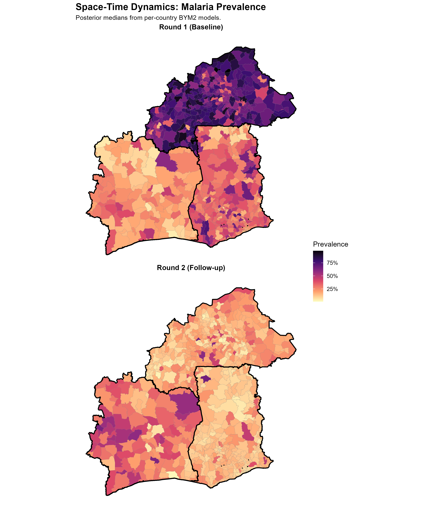{width="75%" style="margin-left: auto; margin-right: auto; display: block;"}

::: {.center-text .xs-text .muted style="margin-top: 10px;"}
Top: Round 1 (Baseline) | Bottom: Round 2 (Follow-up)
:::
:::

::: {.column width="45%"}
### Temporal shifts

::: {.small-text style="width: 100%; margin-left: auto; margin-right: auto;"}

| Parameter | Ghana (GHA) | Burkina Faso (BFA) | Côte d'Ivoire (CIV) |
| :--- | :---: | :---: | :---: |
| R1 (Baseline Prev) | 30.5% | 71.2% | 17.4% |
| R2 (Follow-up Prev) | 12.3% | 16.8% | 31.3% |
| OR (R2 vs R1) | 0.32 | 0.08 | 2.18 |
| $\mu$ (Baseline intercept) | -0.83 | 0.91 | -1.56 |
| $\delta_2$ (Temporal shift) | -1.14 | -2.52 | +0.78 |
| $\sigma_b$ (Spatial SD) | 0.72 | 1.04 | 0.82 |
| $\varphi$ (Spatial fraction) | 0.47 | 0.64 | 0.59 |
| $\sigma_\gamma$ (Interaction SD) | 0.52 | 0.51 | 0.48 |

:::

::: {.xs-text}
$\delta_2$ perfectly maps to the Odds Ratios (e.g., $e^{-2.52} = 0.08$, an ~92% reduction in BFA). $\varphi$ sits near ~0.50 across all three countries, confirming that variance is consistently split between structured geographical risk and local unstructured noise.
:::

::: {.xs-text}
Pooling two rounds doubles the data, justifying the spatial structure that LOO-CV rejected in the single cross-section. BFA's high $\sigma_b = 1.04$ reflects extreme north-south heterogeneity. $\varphi > 0.5$ in BFA and CIV means most variation is spatially structured.
:::

::: {.small-text}

| Covariate | GHA | BFA | CIV |
|---|:---:|:---:|:---:|
| Nightlights   |   | * | * |
| Poverty       | * | * |   |
| Travel time   | * | * |   |
| Temperature   | * |   |   |

The interaction term $\gamma_{it}^*$ isolates the districts that bucked these national trends, providing early warning signals for the Ministry of Health.
:::
:::
::::
---

## Extending the ICAR Across Borders {.smaller}

::: {.two-col}
::: {}
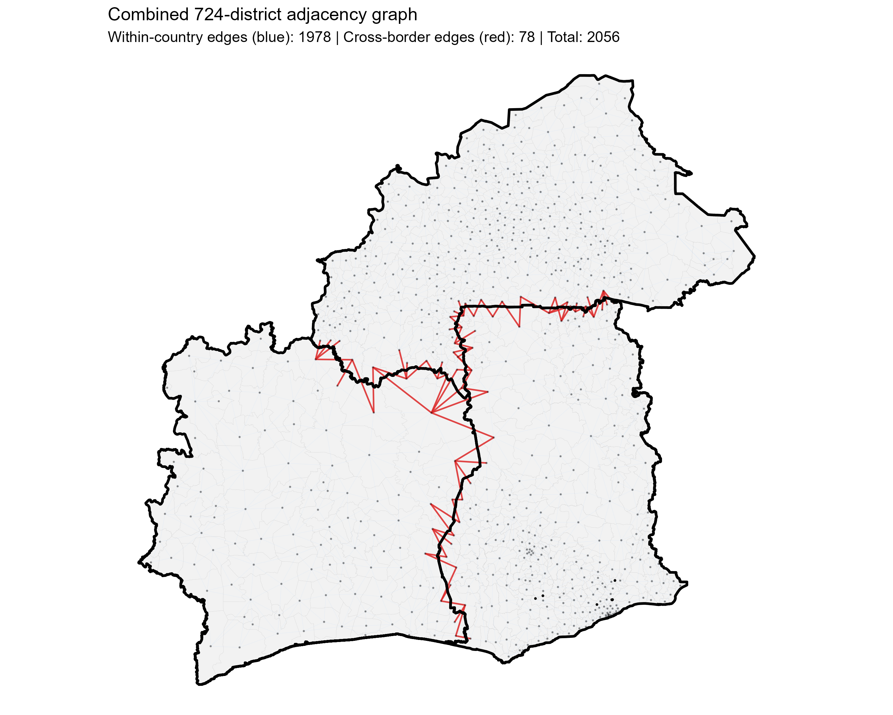{width="95%"}

::: {.xs-text .center-text}
724-district graph. Red = cross-border edges enabling trans-national borrowing.
:::
:::

::: {}
The individual country models treat each nation as an isolated spatial domain. But malaria ecology does not stop at national borders.

Districts along the Ghana-Burkina Faso and Ghana-Cote d'Ivoire borders share similar climates, vector habitats, and population movement patterns.

::: {.info-box .small-text}
By extending the ICAR adjacency structure across borders, we allow border districts to borrow strength from their neighbours in adjacent countries. This is operationalised through queen contiguity on the combined 724-district shapefile.
:::

::: {.small-text}
The model adds country-level structure on top:

$$\theta_{it} = \mu + \alpha_{c[i]} + b_i + \delta_{c[i],t} + \gamma_{it} + \mathbf{x}_{it}^\top \boldsymbol{\beta}_{c[i]}$$

with $\beta_{ck} \sim N(\bar{\beta}_k, \tau_k)$: hierarchical random slopes shrunk toward a shared West African mean.
:::
:::
:::

---

## The Unified Pooled Model {.smaller}

::: {.two-col .wide-left}
::: {}
::: {style="text-align: center;"}
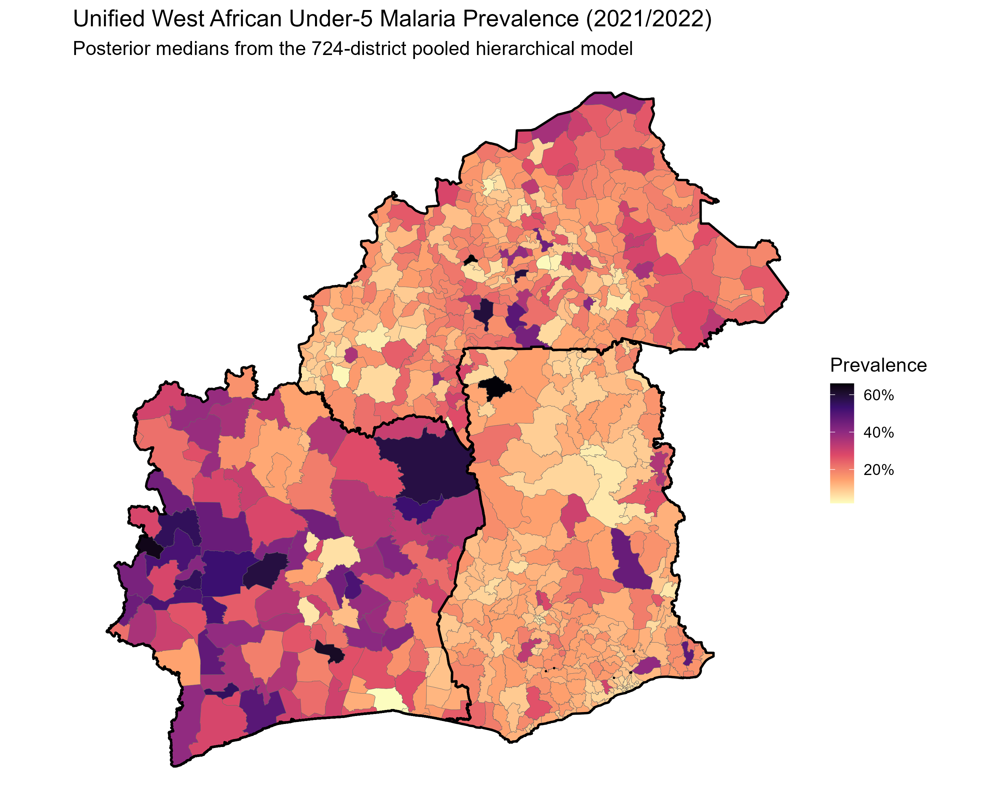{width="95%" style="border: 1px solid #e2e8f0; box-shadow: 0 8px 12px rgba(0,0,0,0.1);"}
:::
:::

::: {}
### Pooled model parameters

::: {.small-text}
| Parameter | Estimate | 95% CrI |
|---|---:|---|
| $\sigma_b$ (spatial SD) | 0.64 | [0.22, 0.98] |
| $\varphi$ (spatial fraction) | 0.81 | [0.43, 0.98] |
| $\delta_{GHA}$ (time shift) | -1.14 | [-1.37, -0.92] |
| $\delta_{BFA}$ (time shift) | -2.53 | [-2.85, -2.22] |
| $\delta_{CIV}$ (time shift) | 0.74 | [0.40, 1.07] |
:::

::: {.small-text .muted}
The spatial parameters ($\varphi = 0.81$, $\sigma_b = 0.64$) prove that over 80\% of unexplained malaria risk is dictated by shared geography, fully validating the BYM2 framework. Concurrently, the temporal shifts ($\delta$) perfectly map the massive prevalence drops in Ghana and Burkina Faso.
:::

### Significant covariates

::: {.small-text}
| Covariate | GHA | BFA | CIV |
|---|:---:|:---:|:---:|
| Elevation          |   | * |  *|
| Nightlights        | * | * | * |
| Temperature        | * |   |   |
| Travel time        | * |   |   |
| Pop. density (log) |   | * | * |
:::
:::
:::

---

## The Covariate Story {.smaller}

::: {.two-col}
::: {}
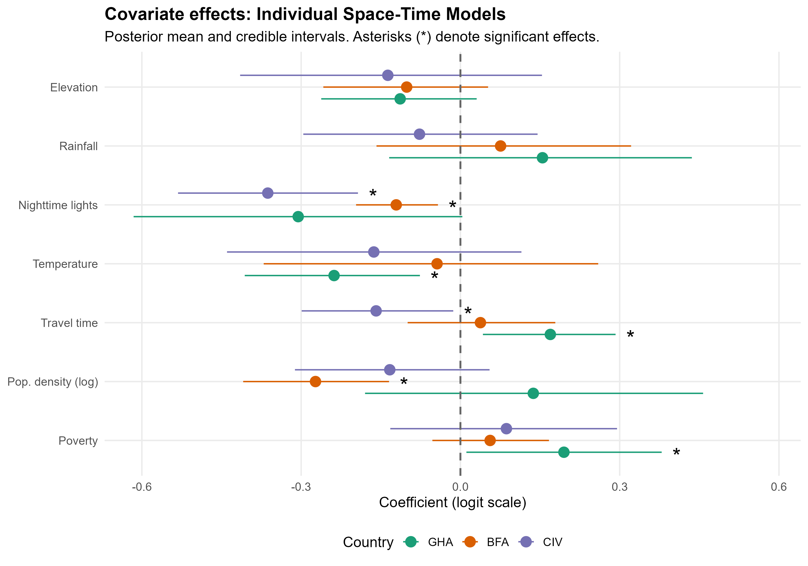{width="100%"}

::: {.xs-text .center-text}
Individual space-time models: wide intervals in data-poor countries.
:::
:::

::: {}
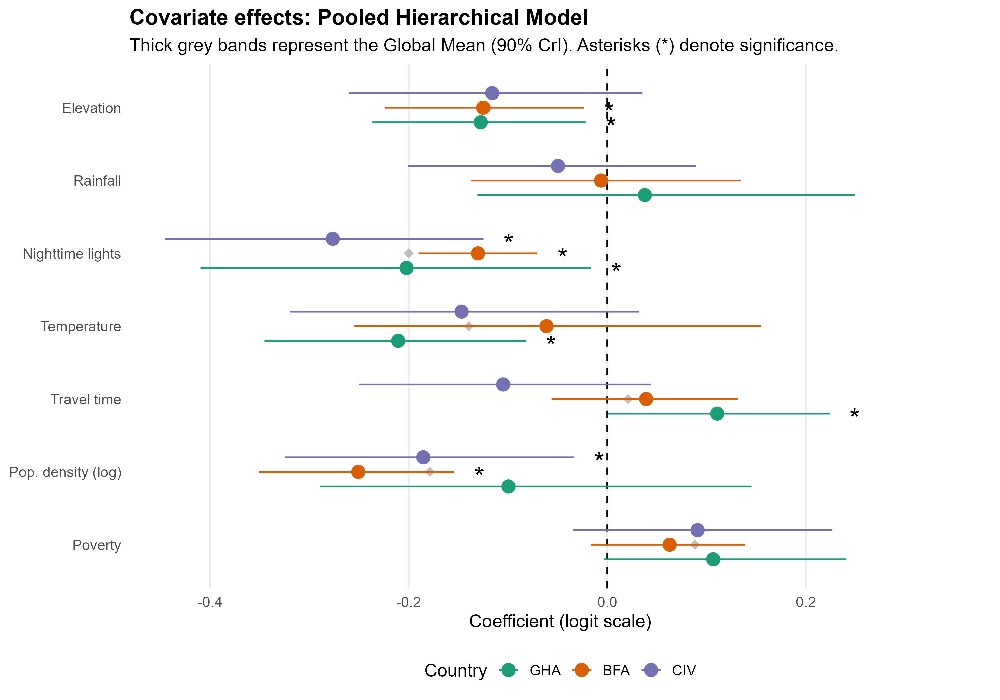{width="100%"}

::: {.xs-text .center-text}
Pooled model: hierarchical shrinkage toward shared West African mean.
:::
:::
:::

::: {.small-text}
- **Nightlights (urbanisation):** consistent protective effect across all three countries. In CIV individual model: non-significant. In pooled: significant. The hierarchical prior rescued the signal.
- **Poverty:** strongest in Ghana (finest-resolution data), attenuated in BFA/CIV where measured at coarser admin level.
- **Temperature in Ghana:** significant in individual model, attenuated in pooled. This suggests the Ghana-specific signal was partly absorbing unmeasured confounding.
- $\tau_k$ (between-country SD): small for nightlights and elevation (genuinely shared effects), larger for poverty and travel time (country-specific relationships).
:::

---

## Districts at Risk {.smaller}

::: {.two-col}
::: {}
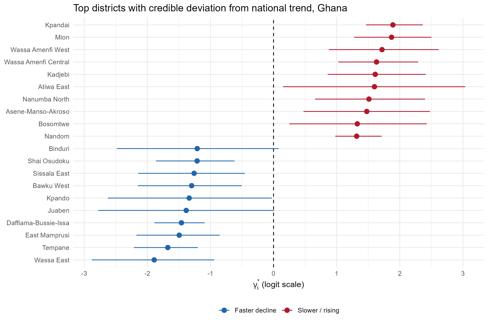{width="100%"}

::: {.xs-text .center-text}
Ghana: districts with credible deviation from the national trend ($\gamma_i^*$).
:::
:::

::: {}
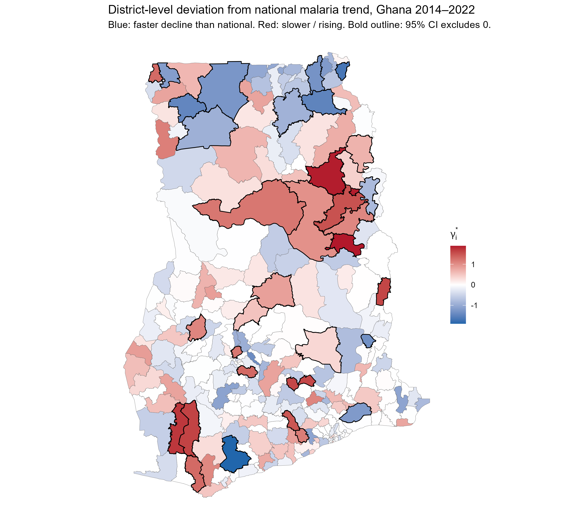{width="75%"}

::: {.xs-text .center-text}
Map of $\gamma_i^*$: blue = faster decline, red = slower/rising.
:::
:::
:::

::: {.small-text}
- **Slower decline / rising:** Kpandai, Mion, Wassa Amenfi West/Central require immediate investigation. These districts are falling behind despite national improvements.
- **Faster decline:** Wassa East, Tempane, East Mamprusi, Daffiama-Bussie-Issa declined faster than the national average, suggesting effective local interventions.
- The $\gamma_{it}^*$ interaction term captures these deviations after accounting for spatial structure, covariates, and the national time trend.
:::

---

## Uncertainty and Reliability {.smaller}

::: {.two-col}
::: {}
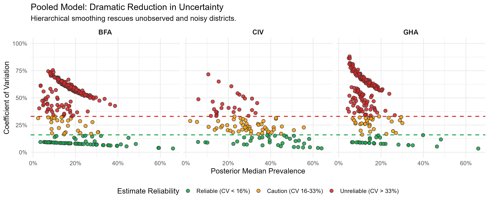{width="100%"}
:::

::: {}
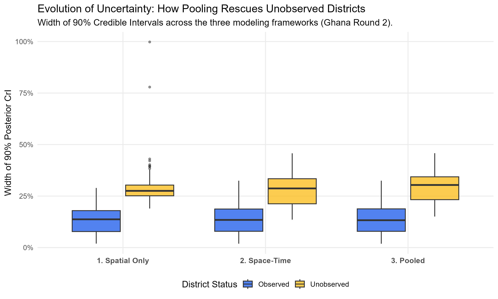{width="100%"}
:::
:::

---

## Shrinkage {.smaller}

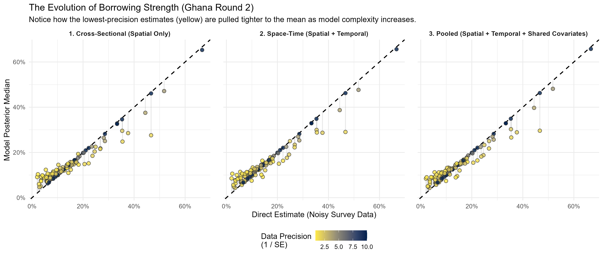{fig-align="center" width="85%"}

::: {.small-text}
High-precision districts (dark blue) remain trusted on the diagonal. Low-precision districts (yellow) are highly scattered in the raw data, but tightly cluster together as model complexity increases (Panel 3), proving the pooled architecture successfully stabilizes weak data.
:::

---

## What We Learned: Separate vs Pooled {.smaller}

:::: {.columns}

::: {.column width="50%"}
### Separate country models

::: {.small-text}

| Parameter | GHA | BFA | CIV |
|---|---:|---:|---:|
| $\sigma_b$ (spatial SD) | 0.72 | 1.04 | 0.82 |
| $\varphi$ (spatial fraction) | 0.47 | 0.64 | 0.59 |
| $\sigma_\gamma$ (interaction SD) | 0.52 | 0.52 | 0.48 |
| $\delta_2$ (time shift) | -1.14 | -2.52 | +0.78 |
| Significant covariates | 4/7 | 2/7 | 1/7 |

:::

::: {.small-text .muted}
* **Robust Time Trends:** The massive drops in prevalence ($\delta$) barely shifted, proving the epidemiological signal is real, not a mathematical artifact.
* **Reduced Noise:** By sharing covariate intelligence, the model stripped away unexplained spatial extremes ($\sigma_b$ dropped to 0.64).
* **Purer Spatial Signal:** Because pooling cleaned up the random noise, the structured geographical signal ($\varphi$) jumped to a massive 81%.
* **Borrowing Strength:** Côte d'Ivoire mathematically leveraged its neighbors to uncover 2 significant covariates, up from just 1 in isolation.
:::
:::

::: {.column width="50%"}
### Pooled 3-country model

::: {.small-text}

| Parameter | Pooled estimate |
|---|---:|
| $\sigma_b$ (spatial SD) | 0.64 |
| $\varphi$ (spatial fraction) | 0.81 |
| $\alpha_{BFA}$ (country shift) | 1.75 |
| $\alpha_{CIV}$ (country shift) | -0.59 |
| $\delta_{GHA}$ (time shift) | -1.14 |
| $\delta_{BFA}$ (time shift) | -2.53 |
| $\delta_{CIV}$ (time shift) | 0.74 |
| Significant covariates (CIV) | 2/7 |

:::
:::

::::

---

## Takeaways and Policy Action {.smaller}

::: {.two-col}
::: {}
### Key findings

**Urbanisation (nightlights)** remained the strongest protective factor across the entire West African block after accounting for spatial and temporal trends.

**The CIV reversal** demands immediate localised investigation. While Ghana and Burkina Faso achieved dramatic reductions (55% and 92% in odds), Cote d'Ivoire experienced a 117% increase.

**Cross-border smoothing** confirmed that malaria ecology is continuous across national boundaries, justifying regional rather than national analysis.
:::

::: {}
### Policy implications

These posterior prevalence maps provide Ministries of Health with the statistical confidence needed to:

- Redirect SMC and ITN campaigns into vulnerable districts identified by the model
- Flag districts where malaria is rising despite national decline (Kpandai, Mion in GHA; broad patterns in CIV)
- Allocate resources proportionally using posterior estimates with credible intervals
- Enable cross-border regional planning using the pooled model estimates
:::
:::

---

## Limitations and Next Steps {.smaller}

:::: {.columns}

::: {.column width="50%"}
### Limitations

- **Ecological fallacy:** district aggregates do not equal individual risk
- Only **two temporal snapshots** per country (T=2 prevents RW1)
- **Unmeasured confounders:** no data on ITN coverage, SMC deployment, health system capacity
- Social covariates at coarser admin level in CIV/BFA than in Ghana
- Pre-2012 nightlights approximated with 2012 VIIRS proxy
- DHS excludes non-household populations
- Census data timing differs across countries

:::

::: {.column width="50%"}
### Next Steps

- **Sensitivity analyses**
- **Cross-validation by country**
- **External Validation** (Malaria Atlas Project)
:::
:::

---

## {.center-text background-color="#ffffff"}

  

::: {.center-text}

 

[**Thank you.**]{style="font-size: 3.3em; color: #e6007e; font-weight: 700;"}
:::

---

## Appendix A: Convergence Diagnostics {.smaller}

::: {.two-col}
::: {}
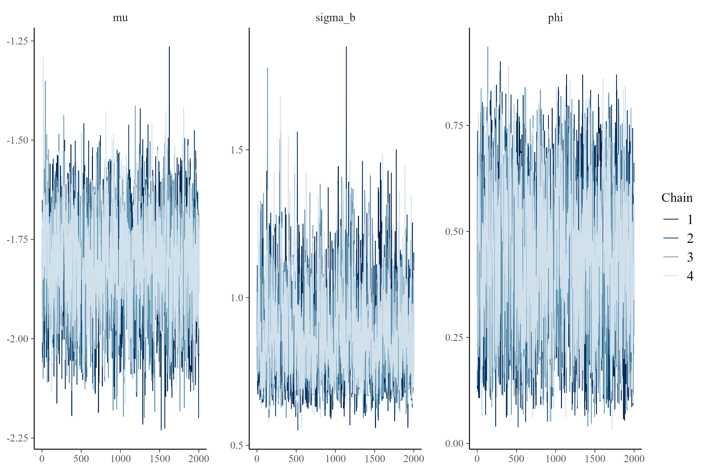{width="75%"}

::: {.xs-text .center-text}
Trace plots: 4 chains, stationary, well-mixed
:::
:::

::: {}
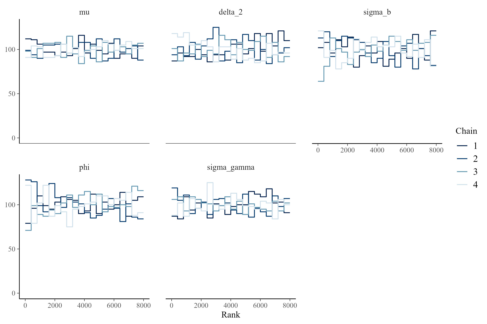{width="75%"}

::: {.xs-text .center-text}
Rank plots: uniform across chains
:::
:::
:::

::: {.two-col}
::: {}
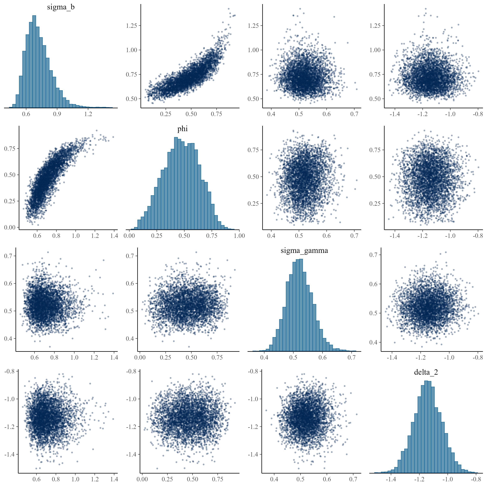{width="65%"}

::: {.xs-text .center-text}
Pairs: no funnels, non-centred parameterisation works
:::
:::

::: {}
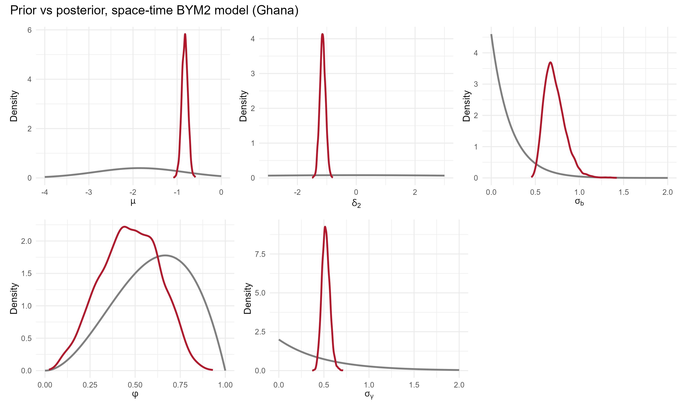{width="75%"}

::: {.xs-text .center-text}
All parameters show substantial learning from data
:::
:::
:::

---

## Appendix B: Posterior Predictive Checks {.smaller}

::: {.two-col}
::: {}
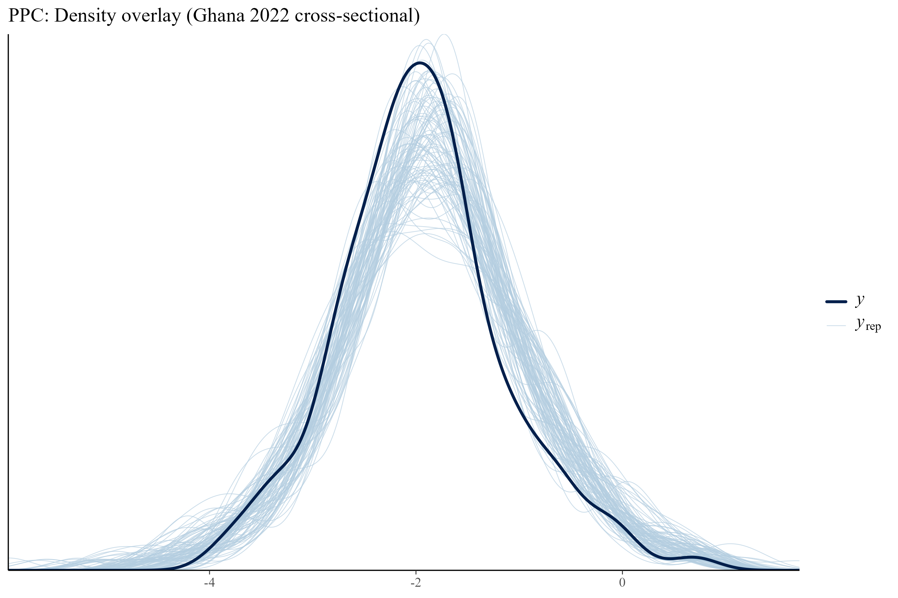{width="75%"}

::: {.xs-text .center-text}
Density overlay: observed inside replicated cloud
:::

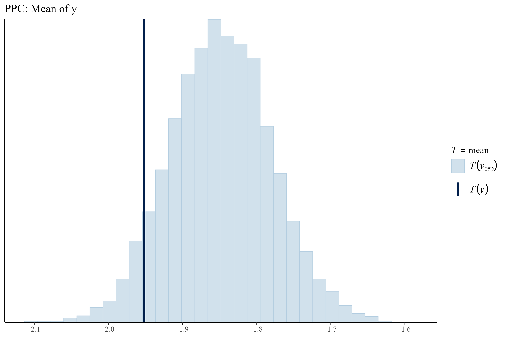{width="75%"}

::: {.xs-text .center-text}
Mean test statistic: captured
:::
:::

::: {}
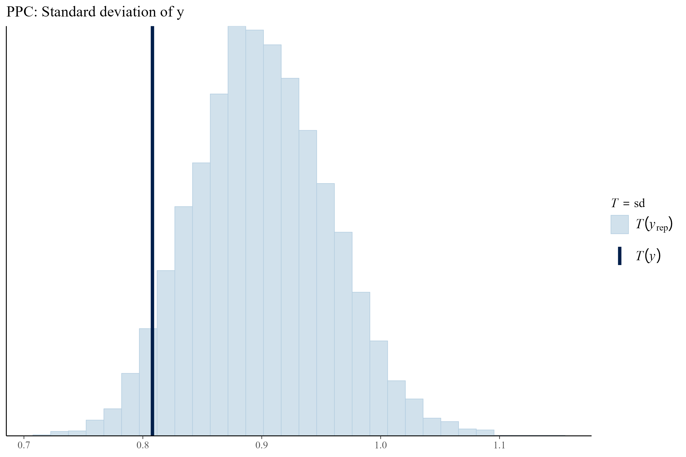{width="75%"}

::: {.xs-text .center-text}
SD: slight overdispersion (conservative)
:::

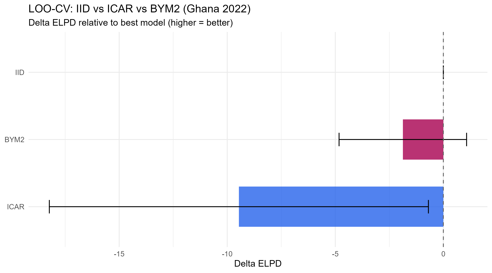{width="75%"}

::: {.xs-text .center-text}
LOO-CV: IID marginally best for single cross-section
:::
:::
:::

---

## Appendix C: Caterpillar Plot and Nightlights vs Prevalence {.smaller}

::: {.two-col}
::: {}
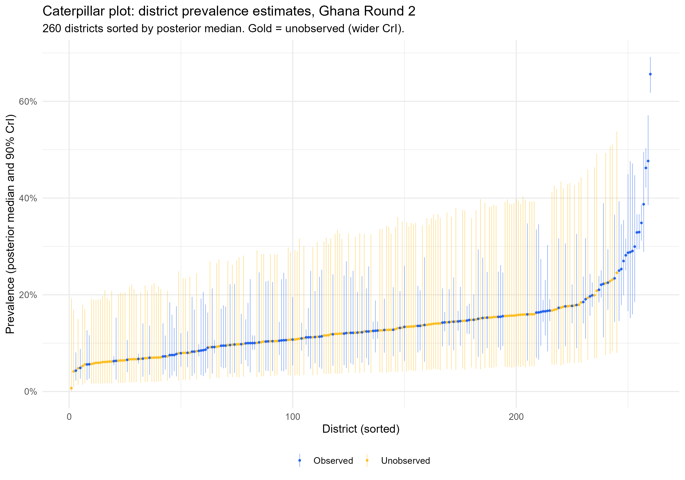{width="100%"}

::: {.xs-text .center-text}
260 Ghana districts sorted by prevalence. Gold = unobserved (wider CrI). The model produces estimates for all districts but is honest about uncertainty.
:::
:::

::: {}
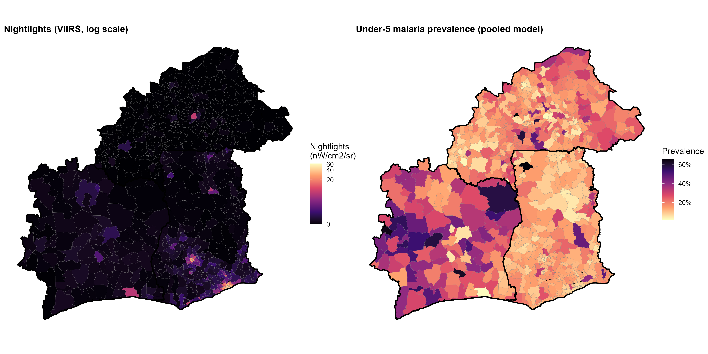{width="100%"}

::: {.xs-text .center-text}
Left: nightlights (urbanisation). Right: pooled prevalence. The inverse spatial pattern is clear: bright areas (urbanised) have low malaria, dark areas (rural) have high malaria.
:::
:::
:::
---

## Appendix D: Model Residual Diagnostics (I) {.smaller}

::: {.two-col}
::: {}
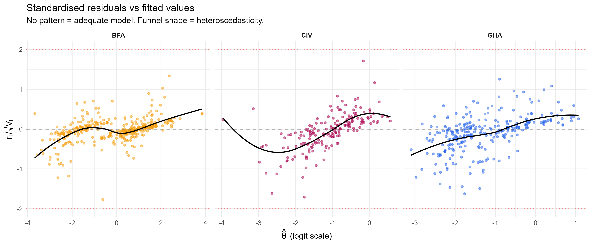{width="75%"}

::: {.xs-text .center-text}
Standardised residuals vs fitted values: no systematic pattern, adequate mean structure
:::
:::

::: {}
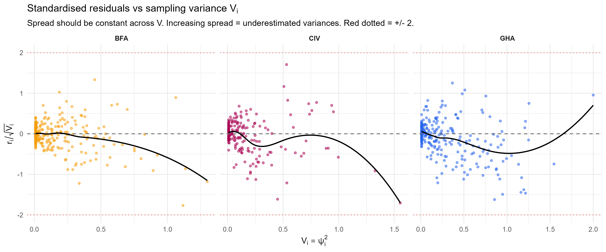{width="75%"}

::: {.xs-text .center-text}
Residuals vs sampling variance: spread roughly constant, no major heteroscedasticity
:::
:::
:::

::: {.two-col}
::: {}
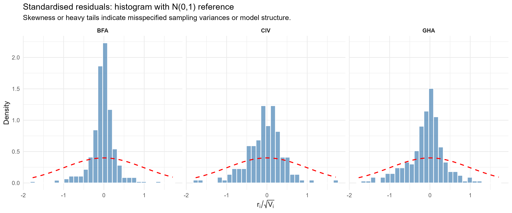{width="75%"}

::: {.xs-text .center-text}
Histogram: mild leptokurtosis (typical for FH models), symmetric
:::
:::

::: {}
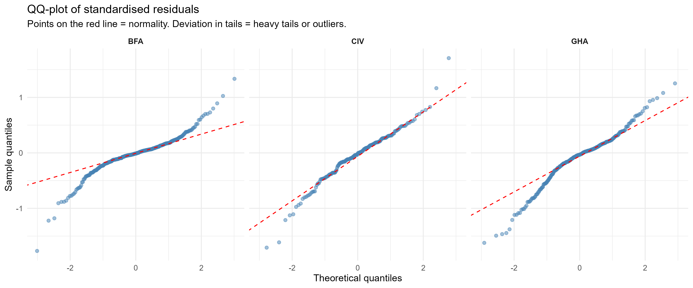{width="75%"}

::: {.xs-text .center-text}
QQ-plot: central bulk follows N(0,1), slight tail departure from outlier districts
:::
:::
:::

---

## Appendix E: Model Residual Diagnostics (II) {.smaller}

::: {.two-col}
::: {}
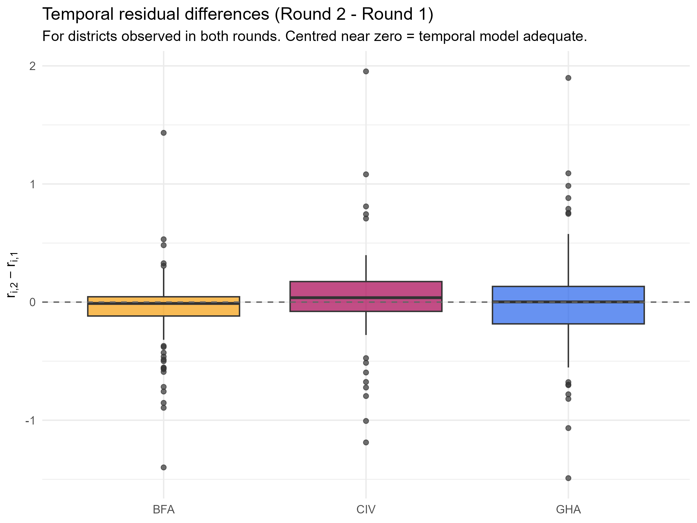{width="75%"}

::: {.xs-text .center-text}
Temporal residual differences centred at zero: Type I interaction captures between-round variation
:::
:::

::: {}
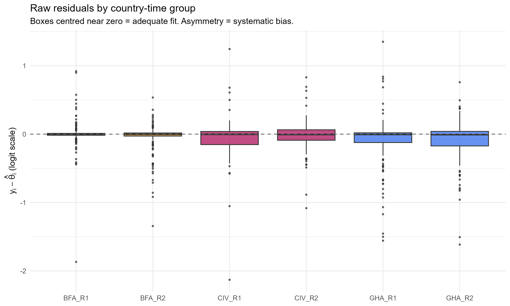{width="85%"}

::: {.xs-text .center-text}
Raw residuals by country-time group: medians at zero, no systematic bias
:::
:::
:::

::: {.two-col}
::: {}
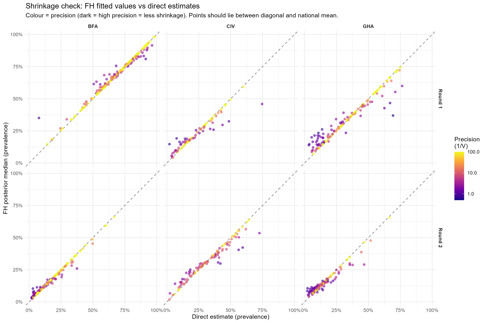{width="75%"}

::: {.xs-text .center-text}
Shrinkage: high-precision districts hug the diagonal, low-precision districts borrow more strength
:::
:::

::: {}
::: {.small-text}
**Summary:** All seven residual diagnostics confirm model adequacy. Residuals are centred at zero across countries and rounds, the temporal structure captures between-round shifts, and shrinkage behaves as expected — stronger borrowing for noisier districts.
:::
:::
:::

---

## Appendix F: References and Data Sources {.smaller}

::: {.two-col}
::: {}
### Methods (Journals)

::: {.xs-text}
* **Riebler et al. (2016)** *Statistical Methods in Medical Research*
* **Knorr-Held (2000)** *Statistics in Medicine*
* **Besag et al. (1991)** *Annals of the Institute of Statistical Mathematics*
* **Wakefield et al. (2020)** *International Statistical Review*
* **Simpson et al. (2017)** *Statistical Science*
* **Li et al. (2019)** *Public Library of Science (PLOS) ONE*
* **Gayawan et al. (2023)** *Spatial Statistics*
* **Assuncao et al. (2019)** *Scientific Reports*
* **Vehtari et al. (2017)** *Statistics and Computing*
* **Rao and Molina (2015)** *John Wiley & Sons*
* **Mercer et al. (2015)** *The Annals of Applied Statistics*
* **Freni-Sterrantino et al. (2018)** *Spatial and Spatio-temporal Epidemiology*
* **Dormann et al. (2013)** *Ecography*
:::
:::

::: {}
### Data Sources

::: {.xs-text}
* **Demographic and Health Surveys (DHS)** (USAID / ICF International)
* **Global Administrative Areas (GADM)** v4.1
* **Climate Hazards Group InfraRed Precipitation with Station data (CHIRPS)** v2.0
* **Climatic Research Unit Time-Series (CRU TS)** v4.09
* **NASA Black Marble** Visible Infrared Imaging Radiometer Suite (VNP46A4)
* **WorldPop** High-Resolution Population Density 2020
* **Oxford Poverty and Human Development Initiative (OPHI)** Global Multidimensional Poverty Index 2024
* **Ghana Statistical Service (GSS)** StatsBank
* **National Institute of Statistics and Demography (INSD)** General Population and Housing Census 2019 (Burkina Faso)
* **National Institute of Statistics (INS)** General Population and Housing Census 2021 (Cote d'Ivoire)
* **World Health Organization (WHO)** World Malaria Report 2023
:::
:::
:::